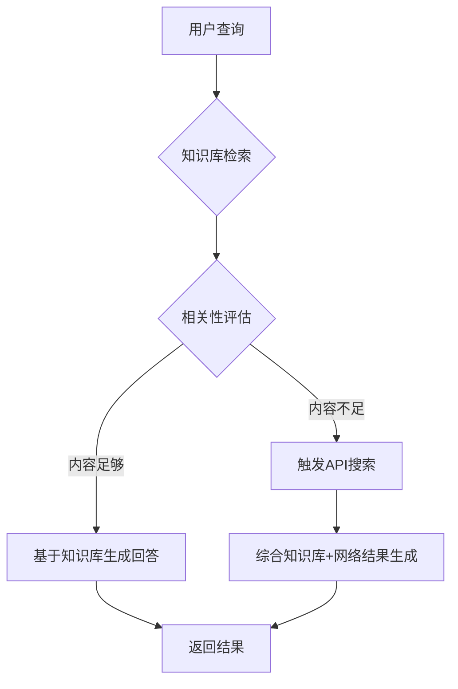
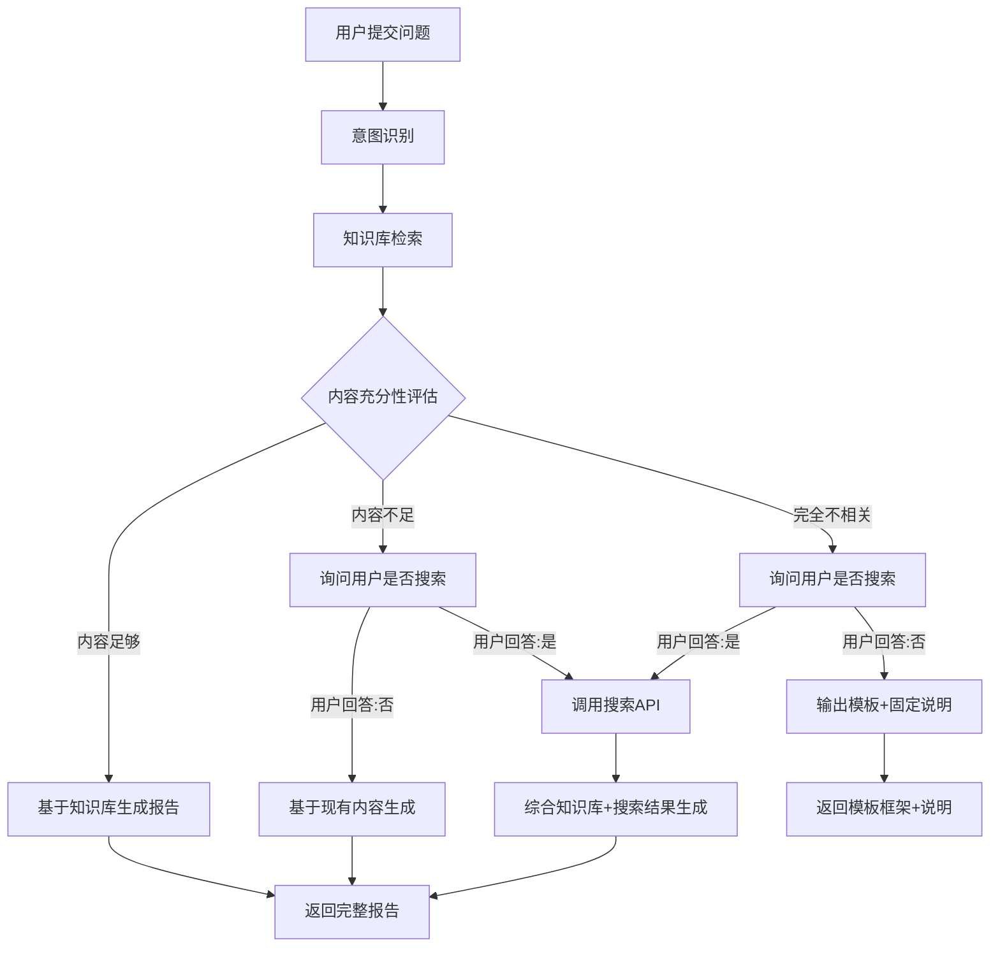

# 个人工作助手项目文档（PRD/TRD）  
## 一、产品需求文档（PRD）
### 1.1 产品愿景
打造轻量级个人工作流AI助手，通过**自动化信息检索→结构化处理→专业汇报生成**闭环，解决职场中重复性资料整理痛点，同时作为AI Agent架构的实践载体。

### 1.2 核心用户画像
| 角色 | 需求场景 | 本项目价值 |
|------|----------|------------|
| 职场执行者 | 每日需整合多源信息生成简报/周报 | 减少80%资料搜集与格式整理时间 |
| AI学习者 | 希望理解工业级Agent工作流设计 | 可视化流程+完整代码实现教学价值 |

### 1.3 功能需求（MVP范围）
| 模块 | 功能点 | 验收标准 |
|------|--------|----------|
| **任务输入** | 文本框提交任务（例：“生成Q3市场趋势分析”） | 支持中文输入，防XSS过滤 |
| **智能处理** | 1. 自动拆解任务步骤2. 调用搜索工具获取资料3. 验证信息可靠性4. 生成结构化报告 | 搜索关键词≥2个；验证失败时触发重规划；报告含摘要/数据/结论 |
| **流式交互** | 实时显示：- Planner思考过程- 搜索关键词/结果摘要- Verifier校验反馈- 最终报告 | 延迟<2s/事件；前端区分消息类型（颜色/图标） |
| **结果导出** | 一键复制报告内容 | 保留Markdown格式 |
| **多轮对话** | 1. 追问报告细节<br>2. 选中段落修改<br>3. 补充扩展内容 | 支持最多10轮上下文；LocalStorage持久化；段落级精准修改 |

### 1.4 非功能需求
- **性能**：单任务端到端耗时≤90秒（含搜索）
- **体验**：SSE断连自动重试（前端实现）
- **安全**：API密钥后端环境变量管理；输入内容长度限制（≤500字符）
- **可观测**：关键节点日志（Planner输出/搜索Query/验证结果）

### 1.5 用户旅程示例
```mermaid
journey
    title “生成行业周报”任务流
    section 用户侧
      输入任务: 5: 用户
      查看实时进度: 4: 用户
      复制报告: 5: 用户
    section 系统侧
      Planner拆解步骤: 5: 系统
      Executor搜索+整理: 4: 系统
      Verifier校验: 3: 系统
      流式推送结果: 5: 系统

### 1.6 多轮对话用户旅程
```mermaid
journey
    title "多轮对话协作"任务流
    section 第一轮：生成报告
      输入任务: 5: 用户
      查看完整报告: 5: 用户
    section 第二轮：追问细节
      选中段落追问: 5: 用户
      获得详细解释: 5: 用户
    section 第三轮：修改内容
      选中段落修改: 4: 用户
      查看修改结果: 5: 用户
    section 第四轮：补充扩展
      要求补充内容: 4: 用户
      获得扩展段落: 5: 用户
```

### 1.7 多轮对话交互规范

**追问模式**
- 触发方式：用户选中报告段落 → 点击"追问"按钮 → 输入问题
- 系统响应：基于选中段落和上下文生成回答，不修改原报告
- 展示方式：在对话框中显示问答记录

**修改模式**
- 触发方式：用户选中报告段落 → 点击"修改"按钮 → 输入修改要求
- 系统响应：仅修改选中段落，保留其他内容不变
- 展示方式：Diff高亮显示修改内容，支持版本对比

**补充模式**
- 触发方式：用户定位插入位置 → 点击"补充"按钮 → 输入补充要求
- 系统响应：在指定位置生成新内容，风格与原文一致
- 展示方式：新内容高亮标识，支持撤销

---

## 四、知识库存储功能（v3.0 新增）

### 4.1 功能概述
引入本地知识库存储系统，支持用户上传和管理个人文档，实现智能查询时优先检索本地知识库，减少对API搜索的依赖，提升响应速度和数据隐私性。

### 4.2 文档管理功能
| 功能模块 | 功能点 | 验收标准 |
|----------|--------|----------|
| **文档上传** | 支持多种格式：TXT, MD, DOC, DOCX, XLS, XLSX, PPT, PPTX, PDF | 单文件最大50MB，支持批量上传 |
| **文档解析** | 自动提取文本内容，智能分块 | 支持表格、段落结构识别 |
| **文档管理** | 查看、删除、状态追踪 | 显示处理状态（待处理/处理中/已完成/失败） |
| **知识库组织** | 支持创建多个知识库，文档分组管理 | 文档可归属不同知识库 |

### 4.3 智能检索工作流


**检索逻辑说明：**
1. **知识库优先检索**：用户提交查询后，系统首先检索本地知识库
2. **相关性评估**：评估知识库内容是否完整、准确回答当前问题
3. **智能决策**：
   - 若知识库内容足够（置信度≥75%），直接基于本地知识生成回答
   - 若知识库内容不足，触发API搜索流程获取补充信息
4. **混合生成**：结合知识库和网络搜索结果生成最终报告

### 4.4 性能与准确性要求
| 指标 | 要求 | 说明 |
|------|------|------|
| **检索响应时间** | ≤500ms | 确保用户体验流畅 |
| **相关性判断准确率** | ≥85% | 避免不必要的API调用或错误的本地知识依赖 |
| **向量存储** | 支持万级文档 | 基于ChromaDB持久化存储 |
| **嵌入模型** | 本地Ollama | 使用nomic-embed-text或其他嵌入模型 |

### 4.5 用户界面
- **知识库管理页面**：独立页面管理文档上传、查看、删除
- **工作台集成**：主页面添加入口，快速访问知识库
- **状态可视化**：显示文档处理状态、知识库统计信息

### 4.6 错误处理机制
| 场景 | 处理策略 |
|------|----------|
| **文档上传失败** | 显示具体错误原因，支持重试 |
| **解析失败** | 记录错误日志，标记文档状态为失败 |
| **知识库检索异常** | 降级到API搜索，确保服务可用 |
| **嵌入模型不可用** | 使用备用哈希编码方案 |

### 4.7 技术架构扩展
```
┌─────────────────────────────────────────────────────────────┐
│                      知识库系统架构                          │
├─────────────────────────────────────────────────────────────┤
│  文档层                                                      │
│  ├── 文件上传 (Multipart)                                    │
│  ├── 格式解析 (PyPDF2, python-docx, pandas)                 │
│  └── 文本分块 (智能句子边界)                                 │
├─────────────────────────────────────────────────────────────┤
│  向量层                                                      │
│  ├── 嵌入生成 (Ollama API / 备用哈希方案)                   │
│  ├── 向量存储 (ChromaDB)                                    │
│  └── 相似度检索 (余弦相似度)                                 │
├─────────────────────────────────────────────────────────────┤
│  智能层                                                      │
│  ├── 相关性评估算法                                          │
│  ├── 覆盖度计算                                              │
│  └── 置信度判断                                              │
├─────────────────────────────────────────────────────────────┤
│  集成层                                                      │
│  ├── 工作流编排 (LangGraph)                                 │
│  ├── 优先检索知识库                                          │
│  └── 智能决策路由                                            │
└─────────────────────────────────────────────────────────────┘
```

---

## 五、报告模板系统（v4.0 新增）

### 5.1 功能概述
提供多种预定义的报告模板，用户可以根据不同场景选择合适的模板，系统将基于模板特定的结构和提示词生成更专业、更符合场景需求的报告。

### 5.2 模板类型
| 模板ID | 模板名称 | 适用场景 | 主要结构 |
|--------|----------|----------|----------|
| **weekly** | 工作周报 | 周工作总结 | 本周概述、工作成果、问题挑战、下周计划 |
| **monthly** | 工作月报 | 月度工作总结 | 月度概述、关键成果、数据分析、项目进展、问题复盘、下月规划 |
| **competitor** | 竞品分析 | 竞品调研 | 竞品概览、产品对比、市场策略、SWOT分析、动态跟踪、应对建议 |
| **industry** | 行业研究 | 行业分析 | 行业概览、市场规模、竞争格局、趋势分析、机会风险、结论建议 |
| **project** | 项目汇报 | 项目管理 | 项目概况、进度状态、资源情况、风险管理、下一步计划 |
| **research** | 研究报告 | 深度研究 | 研究背景、研究方法、研究发现、深度洞察、案例参考、结论建议 |
| **summary** | 总结汇报 | 事件总结 | 背景介绍、执行过程、成果展示、经验总结、后续建议 |
| **marketing** | 营销方案 | 营销策划 | 市场分析、营销目标、策略规划、执行方案、预算规划、效果评估 |

### 5.3 模板特性
- **结构化提示词**：每个模板有特定的Planner提示词和Report提示词
- **分类管理**：模板按工作汇报、市场分析、项目管理、研究分析、营销方案分类
- **默认模板**：系统默认使用"工作周报"模板
- **动态切换**：用户可在任务输入前切换模板

### 5.4 用户界面
- **模板选择器**：位于任务输入区上方，支持下拉选择
- **分类展示**：模板按分类分组展示，便于查找
- **模板预览**：显示模板图标、名称和简短描述
- **选中状态**：当前选中模板高亮显示

### 5.5 技术实现
| 组件 | 实现方式 |
|------|----------|
| **模板定义** | Python Pydantic模型，包含ID、名称、描述、图标、分类、结构、提示词 |
| **模板存储** | 内存中字典存储，启动时加载 |
| **API接口** | `/api/templates` 获取所有模板，`/api/templates/{id}` 获取详情 |
| **前端集成** | 下拉选择器组件，异步加载模板列表 |
| **工作流集成** | Planner节点和Report Generator节点读取模板提示词 |

### 5.6 使用流程
```
用户选择模板 → 输入任务描述 → 系统根据模板提示词规划 → 
基于模板结构生成报告 → 展示结果
```

---

## 六、智能报告生成工作流程（v5.0 新增）

### 6.1 功能概述
实现智能化的报告生成决策流程，系统根据知识库内容与用户问题的相关性，采取不同的生成策略，确保报告内容的准确性和相关性。

### 6.2 工作流程架构


### 6.3 决策路径说明

#### 路径A：知识库内容足够
- **判断条件**：检索到的内容与用户问题高度相关，置信度≥75%
- **处理策略**：直接使用知识库内容结合模板生成完整报告
- **用户交互**：无需额外确认，直接生成

#### 路径B：知识库内容不足
- **判断条件**：检索到部分内容，但不足以完整回答问题，置信度30%-75%
- **处理策略**：
  1. 向用户发起询问："知识库内容不足以完整回答，是否需要通过搜索获取更多信息？"
  2. 用户回答"是"：调用搜索API，结合知识库和搜索结果生成报告
  3. 用户回答"否"：仅使用知识库现有内容尽力生成报告

#### 路径C：知识库内容完全不相关
- **判断条件**：检索到的内容与用户问题不相关，置信度<30%
- **处理策略**：
  1. 向用户发起询问："知识库内容与问题不相关，是否需要通过搜索获取相关信息？"
  2. 用户回答"是"：调用搜索API，基于搜索结果生成报告
  3. 用户回答"否"：不生成实质性内容，仅输出预设的模板样式框架，并在末尾添加固定说明："知识库内容与问题不符，需要您进一步提供更多信息"

### 6.4 用户交互设计

#### 确认对话框
- **触发时机**：知识库内容不足或完全不相关时
- **对话框内容**：
  - 标题：需要更多信息
  - 说明：当前知识库内容[不足以回答/与问题不相关]您的问题
  - 问题：是否需要通过搜索获取更多信息？
  - 按钮：【是，搜索补充】 【否，现有内容】

#### 状态提示
- **意图识别中**："正在分析您的问题..."
- **知识库检索中**："正在检索知识库..."
- **内容评估中**："正在评估内容相关性..."
- **等待用户确认**：显示确认对话框

### 6.5 技术实现

| 组件 | 实现方式 |
|------|----------|
| **意图识别** | 新增 `intent_recognizer_node`，调用LLM分析用户问题核心需求 |
| **内容评估** | 扩展 `knowledge_base_search_node`，增加充分性评估逻辑 |
| **用户确认** | 新增 `user_confirmation_node`，暂停工作流等待用户输入 |
| **决策路由** | 修改 `should_use_knowledge_base` 条件边，支持三种决策路径 |
| **状态管理** | WorkState新增 `intent_analysis`, `kb_sufficiency_level`, `user_confirmed_search` 字段 |

### 6.6 状态定义扩展
```python
class WorkState(TypedDict):
    # ... 原有字段 ...
    # 意图识别
    intent_analysis: Dict[str, Any]  # 意图分析结果
    # 知识库评估
    kb_sufficiency_level: str  # 'sufficient' | 'insufficient' | 'irrelevant'
    # 用户确认
    user_confirmed_search: Optional[bool]  # 用户是否同意搜索
    needs_user_confirmation: bool  # 是否需要用户确认
```

### 6.7 错误处理
| 场景 | 处理策略 |
|------|----------|
| **意图识别失败** | 降级到通用意图，继续执行 |
| **知识库检索异常** | 提示用户知识库不可用，询问是否直接搜索 |
| **用户未响应** | 超时后默认使用搜索，继续生成 |
| **搜索API失败** | 仅使用知识库内容生成，提示用户内容可能不完整 |