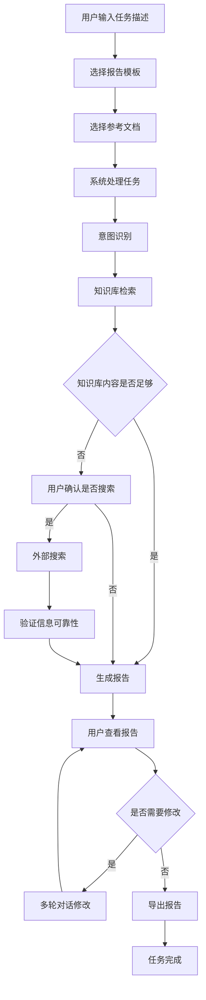
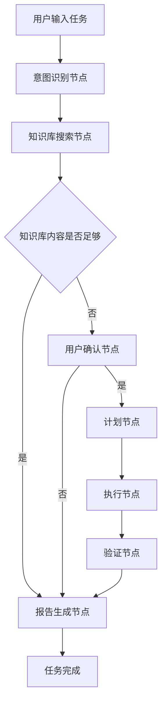
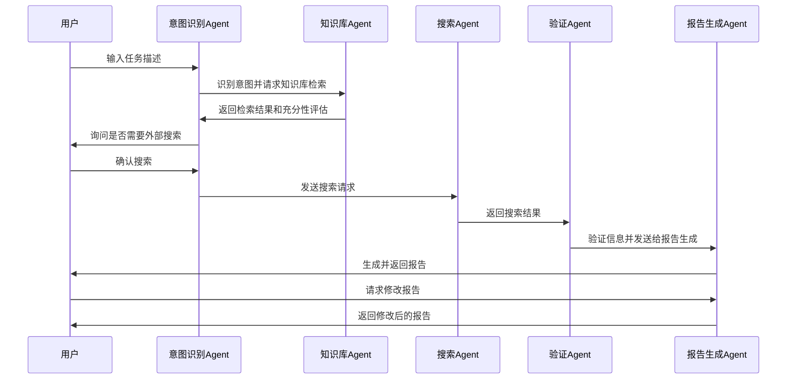

# 个人工作助手 (Personal Work Assistant) 产品需求文档

## 一、基础信息与元数据

| 项目 | 内容 |
|------|------|
| 文档版本 | v0.1.0 |
| 创建人 | 系统分析师 |
| 创建日期 | 2026-02-14 |
| 评审人 | 待定 |
| 关联文档 | [技术需求文档 (TRD.md)](TRD.md) |
| 项目状态 | 草案 |

## 二、业务背景与价值

### 1. 需求背景

在当今信息爆炸的时代，职场人士面临着以下挑战：
- **信息过载**：大量信息需要收集、整理和分析，耗费大量时间和精力
- **重复性工作**：重复性的资料整理工作占用了核心工作时间，影响创造性工作
- **知识管理困难**：缺乏系统化的知识管理和复用机制，信息散落在各处
- **专业输出门槛**：报告撰写需要专业的结构和格式，对非专业人士来说存在一定门槛
- **信息获取分散**：信息获取渠道分散，难以快速获取全面、准确的信息
- **决策支持不足**：缺乏对多源信息的整合和分析能力，影响决策质量

为了解决这些问题，我们需要开发一个AI驱动的个人工作助手，通过Perceive-Brain-Act三层架构，实现自动化信息检索、结构化处理和专业汇报生成的完整闭环，帮助用户提高工作效率，释放更多时间用于创造性工作。

### 2. 业务价值

#### 数据支持
- **效率提升**：将资料搜集与格式整理时间减少80%，单任务处理端到端耗时≤90秒
- **专业输出**：基于预定义模板生成结构化报告，报告生成成功率≥85%
- **智能交互**：支持多轮对话，实现精准修改和扩展，平均响应时间<3秒
- **知识管理**：本地知识库存储，知识库检索响应时间≤500ms，提升信息复用率
- **决策支持**：通过对多源信息的整合和分析，为用户提供更全面、准确的决策依据

#### 用户故事
- **职场新人**："作为一名刚入职的市场专员，我希望能够快速了解行业动态和竞争对手情况，为团队提供有价值的市场分析，而不需要花费大量时间在资料收集和整理上。"
- **中层管理者**："作为一名部门经理，我希望能够快速生成每周工作总结和下周计划，以及月度业务报告，让我有更多时间关注团队管理和业务发展。"
- **研究人员**："作为一名行业研究员，我希望能够快速收集和分析大量行业信息，生成结构化的研究报告，提高研究效率和质量。"
- **自由职业者**："作为一名自由职业者，我希望能够高效处理各种文档工作，如生成项目提案、合同、进度报告等，提升专业形象和工作效率。"
- **学生**："作为一名学生，我希望能够撰写课程论文、研究报告和作业，收集和整理相关资料，提高学习效率和成果质量。"

#### 竞品分析
- **传统办公软件**：如Microsoft Office，虽然功能强大，但主要依赖手动操作，缺乏智能分析和自动化处理能力
- **AI写作工具**：如ChatGPT，虽然能够生成内容，但缺乏系统化的工作流程管理和知识资产积累能力
- **专业报告工具**：如PowerBI，虽然专注于数据可视化，但缺乏文本分析和自然语言生成能力
- **知识管理系统**：如Notion，虽然提供知识存储和组织功能，但缺乏智能分析和报告自动生成能力
- **RPA工具**：RPA依赖规则化流程，难以处理模糊指令和异常情况，而本系统通过AI Agent能够灵活应对各种复杂场景

### 3. 目标与范围

#### 目标（SMART原则）
- **具体**：开发一个AI驱动的个人工作助手，基于Perceive-Brain-Act三层架构，实现自动化信息检索、结构化处理和专业汇报生成的完整闭环
- **可衡量**：
  - 将资料搜集与格式整理时间减少80%
  - 报告生成成功率≥85%
  - 知识库检索响应时间≤500ms
  - 单任务处理端到端耗时≤90秒
  - 平均响应时间<3秒
  - 任务完成准确率≥85%
- **可实现**：基于现有的LangGraph、ChromaDB和DeepSeek API等技术，实现系统功能
- **相关**：解决职场人士信息处理和报告撰写的痛点，提高工作效率和决策质量
- **时限**：MVP版本在3个月内完成开发和测试

#### 范围
- **MVP边界**：
  - 支持智能任务处理和流式交互体验
  - 支持多轮对话协作（追问、修改、补充）
  - 支持知识库管理（文档上传、解析、检索）
  - 支持多种报告模板（工作周报、月报、竞品分析等）
  - 支持本地部署和基本的用户界面
  - 实现Perceive-Brain-Act三层架构的核心功能
  - 集成DeepSeek API和Ollama API作为LLM服务
  - 实现ChromaDB作为向量数据库用于知识库管理
  
- **后续扩展**：
  - 多用户支持和权限管理
  - 云存储和多设备同步
  - 更丰富的报告模板和自定义模板功能
  - 更高级的数据分析和可视化能力
  - 集成更多第三方服务和API
  - 支持语音输入和多语言处理
  - 实现更高级的自我反思和学习能力

## 三、用户角色与场景

### 1. 目标用户

| 用户角色 | 特点 | 需求 |
|---------|------|------|
| 职场新人 | 经验不足，需要快速上手工作，了解行业动态 | 快速收集和整理信息，生成专业报告，学习报告结构和格式 |
| 中层管理者 | 时间紧张，需要频繁生成各类报告和总结 | 快速生成工作总结、计划和业务报告，提高管理效率 |
| 研究人员 | 需要处理大量信息，生成深度研究报告 | 快速收集和分析行业信息，生成结构化研究报告 |
| 自由职业者 | 身兼多职，需要高效处理各种文档工作 | 快速生成提案、合同和项目报告，提高工作效率 |
| 学生 | 需要撰写论文、报告和作业 | 收集和整理资料，生成结构化报告，学习学术写作 |

### 2. 用户故事

#### 故事1：生成市场分析报告
- **用户**：市场专员
- **场景**：需要生成一份关于新能源汽车行业的市场分析报告
- **步骤**：
  1. 在个人工作助手的任务输入区输入任务描述："生成一份2024年新能源汽车行业市场分析报告，包括市场规模、主要玩家、发展趋势和挑战"
  2. 选择"行业研究"报告模板
  3. 点击"生成报告"按钮
  4. 系统开始处理任务，实时展示工作流进度
  5. 系统自动检索相关信息，验证信息可靠性
  6. 生成结构化的市场分析报告
  7. 用户查看报告，对某些部分进行追问和修改
  8. 最终确认报告内容并导出为PDF格式

#### 故事2：管理个人知识库
- **用户**：研究人员
- **场景**：需要将大量研究资料整理到知识库中，方便后续检索和使用
- **步骤**：
  1. 打开个人工作助手的知识库管理页面
  2. 上传多个研究论文和行业报告（PDF、DOCX格式）
  3. 系统自动解析文档内容并生成向量存储
  4. 查看上传的文档列表和处理状态
  5. 后续在生成报告时，系统自动从知识库中检索相关信息

#### 故事3：多轮对话修改报告
- **用户**：部门经理
- **场景**：生成的工作周报需要修改某些部分
- **步骤**：
  1. 查看系统生成的工作周报
  2. 选中需要修改的段落，点击"修改"按钮
  3. 输入修改要求："将本周工作总结部分的项目进度描述得更详细，包括具体的完成情况和遇到的挑战"
  4. 系统根据用户要求修改报告内容
  5. 用户查看修改后的内容，确认是否满意
  6. 如果需要进一步修改，重复上述步骤

### 3. 用户旅程



## 四、AI专用核心模块

### 1. 模型故事

#### 模型思考过程
1. **接收任务**：模型接收到用户的任务描述后，首先进行意图识别，理解用户的具体需求
2. **规划步骤**：根据任务类型和要求，规划完成任务的具体步骤，包括信息检索、分析和报告生成
3. **执行操作**：
   - 首先从本地知识库中检索相关信息
   - 如果知识库内容不足，通过外部搜索获取更多信息
   - 验证获取信息的可靠性和相关性
4. **生成报告**：根据预定义的模板和用户要求，生成结构化的报告
5. **验证结果**：检查报告内容是否符合用户要求，是否存在错误或遗漏
6. **响应用户**：将生成的报告返回给用户，并准备处理用户的后续反馈和修改要求

#### 决策逻辑链条
- **意图识别**：根据用户输入的任务描述，识别任务类型（如报告生成、信息查询等）和具体要求
- **知识库检索**：根据任务类型和要求，从本地知识库中检索相关信息，并评估检索结果的充分性
- **搜索决策**：如果知识库内容不足，决定是否需要通过外部搜索获取更多信息
- **信息验证**：对获取的信息进行可靠性和相关性评估，过滤掉不可靠或不相关的信息
- **报告生成**：根据任务类型和要求，选择合适的报告模板，生成结构化的报告
- **修改处理**：根据用户的修改要求，精准修改报告中的特定部分

### 2. Agent工作流程

#### 单Agent执行任务流程


#### 多Agent分工协作流程


### 3. 提示词设计

#### 意图识别Agent
- **角色**：任务分析师
- **挑战**：准确识别用户任务的意图和具体要求
- **策略**：
  - 分析用户输入的任务描述
  - 识别任务类型（如报告生成、信息查询等）
  - 提取关键信息（如时间范围、主题、要求等）
  - 确定所需的报告模板和参考资料
- **提示词**：
  ```
  你是一名专业的任务分析师，负责分析用户的任务描述并识别其意图。
  
  请分析以下任务描述，识别：
  1. 任务类型（如报告生成、信息查询、数据分析等）
  2. 具体主题和范围
  3. 时间要求（如2024年、最近3个月等）
  4. 格式要求（如字数、结构等）
  5. 建议使用的报告模板
  
  任务描述：{user_input}
  ```
- **输出控制**：
  - 输出JSON格式，包含intent_type、topic、time_range、format_requirements、recommended_template等字段
  - 确保识别结果准确反映用户的真实意图

#### 知识库搜索Agent
- **角色**：知识检索专家
- **挑战**：从知识库中检索与任务相关的信息，并评估检索结果的充分性
- **策略**：
  - 分析任务类型和主题，生成合适的检索查询
  - 从知识库中检索相关信息
  - 评估检索结果的相关性和充分性
  - 生成检索结果摘要
- **提示词**：
  ```
  你是一名专业的知识检索专家，负责从知识库中检索与任务相关的信息。
  
  请根据以下任务信息，从知识库中检索相关信息：
  1. 任务类型：{intent_type}
  2. 具体主题：{topic}
  3. 时间范围：{time_range}
  
  请返回：
  1. 检索到的相关信息摘要
  2. 信息充分性评估（sufficient/insufficient/irrelevant）
  3. 评估理由
  ```
- **输出控制**：
  - 输出JSON格式，包含search_results、sufficiency_level、reason等字段
  - 确保检索结果与任务高度相关

#### 搜索Agent
- **角色**：信息搜索专家
- **挑战**：通过外部搜索获取与任务相关的最新信息
- **策略**：
  - 分析任务类型和主题，生成合适的搜索关键词
  - 执行外部搜索，获取相关信息
  - 提取搜索结果中的关键信息
  - 生成搜索结果摘要
- **提示词**：
  ```
  你是一名专业的信息搜索专家，负责通过外部搜索获取与任务相关的最新信息。
  
  请根据以下任务信息，生成合适的搜索关键词并执行搜索：
  1. 任务类型：{intent_type}
  2. 具体主题：{topic}
  3. 时间范围：{time_range}
  
  请返回：
  1. 搜索关键词
  2. 搜索结果摘要（每个结果包含标题、来源、关键信息）
  3. 搜索结果的相关性评估
  ```
- **输出控制**：
  - 输出JSON格式，包含search_keywords、search_results、relevance_evaluation等字段
  - 确保搜索结果与任务高度相关且为最新信息

#### 验证Agent
- **角色**：信息验证专家
- **挑战**：验证获取信息的可靠性和准确性
- **策略**：
  - 分析信息来源的可信度
  - 验证信息的准确性和一致性
  - 识别可能的错误或偏见
  - 生成验证结果
- **提示词**：
  ```
  你是一名专业的信息验证专家，负责验证获取信息的可靠性和准确性。
  
  请验证以下信息的可靠性：
  1. 信息来源：{source}
  2. 信息内容：{content}
  3. 时间戳：{timestamp}
  
  请返回：
  1. 可靠性评估（high/medium/low）
  2. 评估理由
  3. 可能的错误或偏见（如有）
  4. 建议的处理方式
  ```
- **输出控制**：
  - 输出JSON格式，包含reliability_level、reason、potential_issues、recommendation等字段
  - 确保验证结果客观、准确

#### 报告生成Agent
- **角色**：专业报告撰写专家
- **挑战**：根据获取的信息和用户要求，生成结构化、专业的报告
- **策略**：
  - 分析任务类型和要求，选择合适的报告模板
  - 组织获取的信息，按照模板结构进行整理
  - 撰写报告内容，确保逻辑清晰、语言专业
  - 检查报告的完整性和准确性
- **提示词**：
  ```
  你是一名专业的报告撰写专家，负责根据获取的信息和用户要求，生成结构化、专业的报告。
  
  请根据以下信息生成报告：
  1. 任务类型：{intent_type}
  2. 具体主题：{topic}
  3. 时间范围：{time_range}
  4. 报告模板：{template}
  5. 知识库信息：{kb_info}
  6. 外部搜索信息：{search_info}
  
  请确保：
  1. 报告结构清晰，符合所选模板的格式要求
  2. 内容全面、准确，涵盖所有关键信息
  3. 语言专业、流畅，逻辑连贯
  4. 适当引用信息来源
  ```
- **输出控制**：
  - 输出结构化的报告内容，符合所选模板的格式要求
  - 确保报告内容全面、准确、专业

### 4. 数据需求

#### 数据来源
- **用户输入**：用户的任务描述、修改要求等
- **本地知识库**：用户上传的文档（TXT, MD, DOCX, PDF等）
- **外部搜索**：通过搜索引擎获取的信息
- **系统模板**：预定义的报告模板

#### 数据质量要求
- **数据清洗**：
  - 去除重复信息
  - 过滤掉不相关的信息
  - 纠正明显的错误
- **标注标准**：
  - 文档分类标准：按照文件类型和内容主题进行分类
  - 信息重要性标注：标注信息的重要程度和相关性
  - 可靠性标注：标注信息的可靠性级别

#### 数据更新机制
- **知识库更新**：用户上传新文档时自动更新
- **外部信息更新**：每次执行搜索时获取最新信息
- **模板更新**：系统管理员可以添加和修改报告模板

#### 数据合规性
- **数据授权链路**：
  - 用户上传的文档：用户拥有完全的控制权和所有权
  - 外部搜索的信息：仅用于生成报告，不存储原始数据
- **脱敏方案**：
  - 对用户上传的文档进行脱敏处理，去除敏感信息
  - 对生成的报告进行敏感信息检查，确保不包含敏感内容

### 5. 数据结果计算方法

#### 5.1 任务完成准确率
- **计算方法**：(成功完成的任务数 / 总任务数) × 100%
- **评估标准**：成功完成的任务是指生成的报告满足用户的主要需求，且不需要重大修改
- **测试方法**：使用预设的测试用例，由领域专家评估任务完成情况
- **目标值**：≥85%

#### 5.2 响应时间
- **计算方法**：从用户提交任务到系统开始返回结果的时间间隔
- **评估标准**：记录每次任务的响应时间，计算平均值和分位值
- **测试方法**：使用性能测试工具模拟多用户并发请求，记录响应时间
- **目标值**：平均响应时间<3秒，95%分位响应时间<5秒，99%分位响应时间<8秒

#### 5.3 知识库检索响应时间
- **计算方法**：从发起知识库检索请求到返回检索结果的时间间隔
- **评估标准**：记录每次知识库检索的响应时间，计算平均值
- **测试方法**：使用性能测试工具模拟知识库检索请求，记录响应时间
- **目标值**：≤500ms

#### 5.4 单任务处理端到端耗时
- **计算方法**：从用户提交任务到系统完成任务并返回最终结果的总时间
- **评估标准**：记录每次任务的端到端耗时，计算平均值
- **测试方法**：使用预设的测试用例，记录从提交到完成的总时间
- **目标值**：≤90秒

#### 5.5 报告生成成功率
- **计算方法**：(成功生成报告的任务数 / 总任务数) × 100%
- **评估标准**：成功生成报告是指系统能够生成符合模板要求的完整报告
- **测试方法**：使用预设的测试用例，检查生成的报告是否完整、符合模板要求
- **目标值**：≥85%

#### 5.6 信息检索准确率
- **计算方法**：(检索到的相关信息数 / 检索到的总信息数) × 100%
- **评估标准**：相关信息是指与任务主题直接相关的信息
- **测试方法**：使用预设的测试用例，由领域专家评估检索结果的相关性
- **目标值**：≥90%

#### 5.7 信息提取准确率
- **计算方法**：(正确提取的信息数 / 提取的总信息数) × 100%
- **评估标准**：正确提取的信息是指与原始信息一致且完整的信息
- **测试方法**：使用预设的测试用例，将提取的信息与原始信息进行比对
- **目标值**：≥88%

#### 5.8 报告质量
- **结构完整性**：(报告包含的必要章节数 / 模板要求的总章节数) × 100%
  - **目标值**：≥90%
- **内容相关性**：(报告中相关内容占比 / 报告总内容) × 100%
  - **目标值**：≥85%
- **语言流畅性**：由领域专家对报告语言流畅性进行评分（0-100分）
  - **目标值**：≥90%

#### 5.9 幻觉率
- **计算方法**：(报告中包含的虚假信息数 / 报告总信息数) × 100%
- **评估标准**：虚假信息是指无事实依据或与事实不符的信息
- **测试方法**：使用预设的测试用例，由领域专家检查报告中是否包含虚假信息
- **目标值**：≤10%

#### 5.10 系统可用性
- **计算方法**：(系统可用时间 / 总时间) × 100%
- **评估标准**：系统可用时间是指系统能够正常响应请求的时间
- **测试方法**：通过监控系统运行状态，记录系统可用时间
- **目标值**：≥99.9%

### 6. 模型评估标准

#### 核心指标
- **准确率**：关键问题准确率≥85%
- **召回率**：信息检索召回率≥80%
- **报告质量**：报告结构完整性≥90%，内容相关性≥85%，语言流畅性≥90%
- **响应时间**：
  - 平均响应时间<3秒
  - 知识库检索响应时间≤500ms
  - 单任务处理端到端耗时≤90秒
- **可扩展性**：
  - 支持≥10万条文档
  - 支持并发处理≥10个任务
- **安全性**：
  - 仅允许内部用户访问
  - 数据传输加密
  - 敏感信息过滤
- **幻觉率**：≤10%
- **系统可用性**：≥99.9%

## 五、功能需求

### 1. 功能清单

| 功能点 | 功能描述 | 优先级 |
|--------|----------|--------|
| 智能任务处理 | 基于Perceive-Brain-Act三层架构，自动拆解任务步骤，调用搜索工具获取资料，验证信息可靠性，生成结构化报告 | 高 |
| 流式交互体验 | 实时显示处理进度，可视化AI模型思考过程，搜索关键词和结果摘要，最终报告流式输出，事件延迟<2秒/事件 | 高 |
| 多轮对话协作 | 支持追问模式、修改模式和补充模式，实现精准修改和扩展，平均响应时间<3秒 | 高 |
| 知识库管理 | 支持多种格式文档上传，智能文档解析和向量存储，本地知识库优先检索，相关性评估和智能决策，知识库检索响应时间≤500ms | 高 |
| 报告模板系统 | 提供工作周报、月报、竞品分析、行业研究、项目汇报、研究报告、总结汇报、营销方案等8种模板，支持自定义模板 | 高 |
| 报告导出 | 支持导出为TXT、Markdown、Word、PDF等格式，导出成功率≥95% | 中 |
| 历史记录管理 | 保存历史任务和报告，支持按时间、类型、关键词搜索和查看历史记录，历史记录保存期限≥90天 | 中 |
| 实时建议 | 根据用户输入提供任务描述建议，帮助用户优化任务描述，建议准确率≥80% | 低 |
| 系统设置 | 支持LLM模型选择、知识库配置、系统参数调整等设置，确保系统灵活性和可定制性 | 中 |
| 监控与日志 | 提供系统运行状态监控、任务执行日志、错误记录等功能，确保系统可观测性 | 中 |

### 2. 功能详细说明

#### 智能任务处理
- **界面内容**：任务输入区，包含文本输入框、模板选择器、文档选择器、提交按钮
- **样式与交互**：赛博朋克风格，实时显示输入字数，提供任务描述建议
- **逻辑**：
  - 接收用户任务描述
  - 选择报告模板和参考文档
  - 调用意图识别Agent分析任务意图
  - 调用知识库Agent检索相关信息
  - 评估知识库内容充分性
  - 如需外部信息，调用搜索Agent获取最新信息
  - 调用验证Agent验证信息可靠性
  - 调用报告生成Agent生成结构化报告
  - 实时展示处理进度
- **前后置事件**：
  - 前置：用户输入任务描述
  - 后置：生成报告，显示处理结果
- **异常处理**：
  - 输入为空时提示用户
  - 处理失败时显示错误信息，记录错误日志
  - 网络超时时有重试机制，最多重试3次，每次间隔5秒
  - 外部API不可用时切换到本地知识库模式

#### 流式交互体验
- **界面内容**：智能工作流展示区，包含工作流节点、处理状态、实时信息
- **样式与交互**：动态节点动画，实时更新处理状态，支持点击查看详情
- **逻辑**：
  - 实时显示工作流进度，包括意图识别、知识库检索、外部搜索、信息验证、报告生成等步骤
  - 可视化AI模型的思考过程，包括任务规划、工具选择、执行决策等
  - 显示搜索关键词和结果摘要，包括搜索结果标题、来源、关键信息
  - 流式输出最终报告，逐句显示生成内容
- **前后置事件**：
  - 前置：用户提交任务
  - 后置：任务处理完成，显示最终报告
- **异常处理**：
  - 处理过程中网络中断时，保存处理状态，恢复连接后继续处理
  - 显示处理过程中的错误信息，提供错误原因和建议
  - 流式输出失败时，切换到完整报告一次性输出模式

#### 多轮对话协作
- **界面内容**：报告查看区，包含报告内容、修改按钮、追问按钮、补充按钮
- **样式与交互**：支持文本选择，点击按钮弹出对话框，显示修改前后的对比
- **逻辑**：
  - 追问模式：基于选中段落获取详细解释，支持多轮追问
  - 修改模式：精准修改报告中的特定段落，支持指定修改范围和要求
  - 补充模式：在指定位置添加新内容，支持指定补充内容的类型和格式
- **前后置事件**：
  - 前置：用户查看生成的报告
  - 后置：显示修改后的报告，更新报告内容
- **异常处理**：
  - 修改失败时显示错误信息，记录错误日志
  - 输入为空时提示用户
  - 多轮对话超时（超过30分钟无响应）时自动结束对话

#### 知识库管理
- **界面内容**：知识库管理页面，包含文档上传区、文档列表、处理状态
- **样式与交互**：拖拽上传，实时显示上传进度，支持文档过滤和搜索
- **逻辑**：
  - 支持多种格式文档上传（TXT, MD, DOCX, PDF等），单个文件大小上限100MB
  - 智能文档解析和向量存储，使用nomic-embed-text模型生成向量嵌入
  - 本地知识库优先检索，使用语义相似度搜索，结合元数据过滤和关键词匹配
  - 相关性评估和智能决策，关键信息检索准确率≥90%，相关信息召回率≥85%
  - 支持文档分类、标签管理、版本控制等功能
- **前后置事件**：
  - 前置：用户上传文档
  - 后置：文档处理完成，显示处理状态
- **异常处理**：
  - 上传失败时显示错误信息，记录错误日志
  - 文档解析失败时提示用户，提供失败原因
  - 文件大小超过限制时提示用户
  - 向量存储失败时自动重试，最多重试3次

#### 报告模板系统
- **界面内容**：模板选择器，包含模板分类和模板列表
- **样式与交互**：下拉菜单选择，显示模板预览
- **逻辑**：
  - 提供8种预定义报告模板：工作周报、月报、竞品分析、行业研究、项目汇报、研究报告、总结汇报、营销方案
  - 根据任务类型推荐合适的模板，推荐准确率≥90%
  - 支持自定义模板，包括模板创建、编辑、删除等功能
  - 模板应用准确率≥95%
- **前后置事件**：
  - 前置：用户选择模板
  - 后置：系统根据模板生成报告
- **异常处理**：
  - 模板加载失败时使用默认模板
  - 模板不存在时提示用户
  - 自定义模板保存失败时显示错误信息

#### 报告导出
- **界面内容**：导出选项区，包含格式选择器、导出按钮
- **样式与交互**：下拉菜单选择格式，导出进度条显示
- **逻辑**：
  - 支持导出为TXT、Markdown、Word、PDF等格式
  - 根据选择的格式生成对应文件，生成时间≤30秒
  - 提供下载链接或直接下载
  - 导出文件命名规则：报告类型_时间戳.扩展名
- **前后置事件**：
  - 前置：用户查看生成的报告
  - 后置：文件下载完成，提示用户
- **异常处理**：
  - 导出失败时显示错误信息，记录错误日志
  - 文件格式不支持时提示用户
  - 导出文件过大时提示用户，建议分批次导出

#### 历史记录管理
- **界面内容**：历史记录页面，包含任务列表、搜索框、筛选器
- **样式与交互**：支持按时间、类型、关键词筛选，点击查看详情
- **逻辑**：
  - 保存历史任务和报告，保存期限≥90天
  - 支持按时间、类型、关键词搜索历史记录，搜索响应时间≤1秒
  - 支持查看历史报告详情和修改历史，修改历史记录≥10次
  - 支持历史任务重新执行，重新执行成功率≥90%
- **前后置事件**：
  - 前置：任务完成
  - 后置：历史记录更新，用户查看历史记录
- **异常处理**：
  - 历史记录加载失败时显示错误信息，记录错误日志
  - 搜索无结果时提示用户
  - 历史记录保存失败时自动重试，最多重试3次

#### 实时建议
- **界面内容**：任务输入框下方的建议区域
- **样式与交互**：实时显示建议，支持点击采纳
- **逻辑**：
  - 根据用户输入提供任务描述建议，帮助用户优化任务描述
  - 建议基于历史任务、模板要求、常见任务类型等生成
  - 建议准确率≥80%
  - 支持最多5条建议同时显示
- **前后置事件**：
  - 前置：用户输入任务描述
  - 后置：用户采纳建议或继续输入
- **异常处理**：
  - 建议生成失败时不影响用户输入
  - 无建议时不显示建议区域

#### 系统设置
- **界面内容**：系统设置页面，包含模型设置、知识库设置、系统参数设置等
- **样式与交互**：表单输入、下拉选择、开关按钮等
- **逻辑**：
  - 支持LLM模型选择，包括DeepSeek API和Ollama API
  - 支持知识库配置，包括存储路径、向量模型选择、索引设置等
  - 支持系统参数调整，包括响应时间阈值、重试次数、日志级别等
  - 支持设置保存和加载，确保设置持久化
- **前后置事件**：
  - 前置：用户进入设置页面
  - 后置：设置保存生效
- **异常处理**：
  - 设置保存失败时显示错误信息，记录错误日志
  - 无效设置时提供默认值
  - 设置变更后提示用户重启系统生效

#### 监控与日志
- **界面内容**：监控与日志页面，包含系统运行状态、任务执行日志、错误记录等
- **样式与交互**：图表显示、日志列表、筛选器等
- **逻辑**：
  - 提供系统运行状态监控，包括CPU使用率、内存使用率、磁盘使用率、网络带宽等
  - 提供任务执行日志，包括任务ID、类型、状态、开始时间、结束时间、执行结果等
  - 提供错误记录，包括错误类型、错误消息、发生时间、关联任务等
  - 支持日志搜索和导出，导出格式包括CSV、JSON等
- **前后置事件**：
  - 前置：系统启动
  - 后置：用户查看监控与日志
- **异常处理**：
  - 监控数据采集失败时显示错误信息
  - 日志记录失败时自动重试，最多重试3次
  - 日志文件过大时自动轮转，保留最近30天日志

### 3. AI功能点

| 功能点 | 依赖AI/Agent | 描述 |
|--------|-------------|------|
| 意图识别 | 意图识别Agent | 识别用户任务的意图和具体要求，意图识别准确率≥90% |
| 知识库检索 | 知识库Agent | 从本地知识库中检索相关信息，知识库检索准确率≥90% |
| 外部搜索 | 搜索Agent | 通过外部搜索获取最新信息，搜索结果相关性≥85% |
| 信息验证 | 验证Agent | 验证获取信息的可靠性和准确性，信息验证准确率≥88% |
| 报告生成 | 报告生成Agent | 根据获取的信息和用户要求，生成结构化、专业的报告，报告生成成功率≥85% |
| 报告修改 | 报告生成Agent | 根据用户的修改要求，精准修改报告内容，修改准确率≥85% |
| 相关性评估 | 知识库Agent | 评估检索结果的相关性和充分性，相关性评估准确率≥85% |
| 任务规划 | 任务规划模块 | 拆解任务步骤，制定执行计划，任务规划完整性≥85% |
| 自我反思 | 自我反思模块 | 评估执行效果，调整执行策略，反思准确率≥80% |
| 模板推荐 | 报告生成Agent | 根据任务类型推荐合适的报告模板，模板推荐准确率≥90% |

## 六、非功能需求

### 1. 性能需求
- **响应时间**：
  - 平均响应时间<3秒
  - 95%分位响应时间<5秒
  - 99%分位响应时间<8秒
  - 流式交互事件延迟<2秒/事件
  - 知识库检索响应时间≤500ms
- **处理能力**：
  - 单任务处理端到端耗时≤90秒
  - 支持≥10个并发任务，峰值可扩展至≥100个并发
  - 每秒可处理≥5个请求
- **吞吐量**：
  - 知识库支持≥10万条文档
  - 向量存储支持≥100万条向量
  - 历史记录支持≥100万条任务记录

### 2. 准确性需求
- **任务完成准确率**：≥85%
- **信息检索准确率**：≥90%
- **信息提取准确率**：≥88%
- **报告质量**：
  - 结构完整性≥90%
  - 内容相关性≥85%
  - 语言流畅性≥90%
- **幻觉率**：≤10%
- **模板应用准确率**：≥95%

### 3. 可用性需求
- **系统可用性目标**：99.9%
- **故障恢复时间**：<5分钟
- **计划内维护时间**：每周一次，每次≤30分钟
- **系统稳定性**：连续运行72小时无故障
- **容错能力**：网络中断后能恢复处理，无数据丢失

### 4. 可解释性要求
- **敏感场景**：在生成重要报告时，模型必须支持生成解释性报告，说明信息来源和处理过程
- **决策过程**：展示AI模型的决策过程，包括信息检索、分析和报告生成的步骤
- **透明度**：提供模型处理过程的可视化展示，让用户了解AI是如何完成任务的
- **可追溯性**：记录所有AI决策的依据和过程，确保决策可追溯

### 5. 安全性需求
- **数据安全**：
  - 数据传输加密：使用TLS 1.3协议
  - 数据存储加密：敏感数据使用AES-256算法
  - 访问控制：基于角色的访问控制（RBAC）
- **隐私保护**：
  - 数据匿名化：不存储用户身份信息
  - 脱敏处理：自动识别并处理敏感信息
  - 数据最小化：只收集和存储必要的数据
- **合规性**：
  - 符合GDPR、网络安全法等法规要求
  - 符合ISO 27001信息安全管理体系标准
  - 符合等保三级认证要求

### 6. 可扩展性需求
- **水平扩展**：支持通过增加实例数量来扩展系统容量
- **垂直扩展**：支持通过增加硬件资源来提高单实例性能
- **功能扩展**：支持插件机制，便于添加新功能
- **集成扩展**：支持与第三方服务和API的集成

### 7. 可靠性需求
- **故障恢复**：当系统组件失败时，能够自动检测并恢复
- **冗余设计**：关键组件采用冗余设计，提高系统可靠性
- **备份策略**：定期备份数据，支持增量备份和全量备份
- **灾难恢复**：制定详细的灾难恢复计划，确保系统在灾难发生后能够快速恢复

### 8. 风险管理
- **幻觉风险**：
  - 症状：模型生成的内容可能包含虚假信息
  - 应对：增加信息验证环节，对重要信息进行多源验证，幻觉率≤10%
- **延迟风险**：
  - 症状：处理复杂任务时可能出现响应延迟
  - 应对：优化系统架构，使用流式输出，提供处理进度提示，平均响应时间<3秒
- **合规风险**：
  - 症状：可能处理或生成包含敏感信息的内容
  - 应对：增加敏感信息过滤，确保数据合规性，符合GDPR、网络安全法等法规要求
- **依赖风险**：
  - 症状：依赖外部API可能导致服务不稳定
  - 应对：建立备用方案，当外部API不可用时使用本地知识库，实现模型切换和故障转移机制
- **性能风险**：
  - 症状：系统在高负载下可能出现性能下降
  - 应对：优化系统架构，实现负载均衡，增加缓存机制，支持水平扩展
- **安全风险**：
  - 症状：系统可能遭受网络攻击或数据泄露
  - 应对：加强安全防护，实现数据加密，定期进行安全审计和渗透测试

### 9. 降级策略
- **AI模型不可用**：
  - 启用本地知识库优先模式，仅使用本地存储的信息
  - 提供基础的模板填充功能，让用户手动输入信息
  - 自动切换到备选模型，实现故障转移
- **搜索服务不可用**：
  - 仅使用本地知识库中的信息
  - 提示用户搜索服务不可用，建议上传相关文档到知识库
  - 记录搜索服务不可用的时间和原因
- **网络连接中断**：
  - 保存当前处理状态
  - 网络恢复后自动继续处理
  - 提供离线模式，仅使用本地功能
  - 定期同步离线数据到服务器
- **系统资源不足**：
  - 启用资源限制，优先保证核心功能
  - 队列管理，延迟处理非紧急任务
  - 自动扩展资源，确保系统稳定运行

### 10. 监控与埋点需求
- **性能监控**：
  - 记录模型响应时间、准确率和可用性
  - 监控系统资源使用情况（CPU、内存、磁盘、网络）
  - 跟踪任务处理成功率、平均处理时间和错误率
- **用户行为监控**：
  - 记录用户输入和操作，分析用户使用频率和功能偏好
  - 跟踪用户满意度，收集用户反馈
  - 分析用户任务类型分布，优化系统功能
- **错误监控**：
  - 记录系统错误和异常，分析错误原因和频率
  - 提供错误预警机制，当错误率超过阈值时触发告警
  - 实现错误分类和优先级管理，确保严重错误得到及时处理
- **安全监控**：
  - 监控系统安全事件，记录可疑操作
  - 定期进行安全扫描，发现并修复安全漏洞
  - 实现安全审计跟踪，确保操作可追溯
- **埋点策略**：
  - 关键操作埋点：用户登录、任务提交、报告生成、报告导出等
  - 性能埋点：响应时间、处理时间、资源使用等
  - 错误埋点：系统错误、API错误、用户操作错误等
  - 用户行为埋点：功能使用频率、停留时间、操作路径等

## 七、验收标准与里程碑

### 1. 量化验收标准

#### 1.1 功能验收
- **智能任务处理**：
  - 用50条常见任务测试，成功率≥85%
  - 任务拆解准确率≥90%
  - 信息验证成功率≥88%
  - 报告生成成功率≥85%
- **流式交互体验**：
  - 实时显示处理进度，无明显延迟
  - 流式交互事件延迟<2秒/事件
  - 处理过程可视化准确率≥95%
  - 最终报告流式输出流畅度≥90%
- **多轮对话协作**：
  - 支持追问模式、修改模式和补充模式
  - 修改准确率≥85%
  - 追问响应准确率≥90%
  - 补充内容相关性≥85%
- **知识库管理**：
  - 支持上传和处理多种格式文档（TXT, MD, DOCX, PDF等）
  - 文档处理成功率≥90%
  - 知识库检索准确率≥90%
  - 知识库检索响应时间≤500ms
- **报告模板系统**：
  - 提供8种预定义报告模板
  - 模板应用准确率≥95%
  - 自定义模板创建成功率≥90%
  - 模板推荐准确率≥90%
- **报告导出**：
  - 支持导出为TXT、Markdown、Word、PDF等格式
  - 导出成功率≥95%
  - 导出文件格式正确性≥98%
  - 导出文件大小合理性≥90%
- **历史记录管理**：
  - 保存历史任务和报告，保存期限≥90天
  - 历史记录搜索响应时间≤1秒
  - 历史任务重新执行成功率≥90%
  - 历史记录加载成功率≥95%
- **实时建议**：
  - 根据用户输入提供任务描述建议
  - 建议准确率≥80%
  - 建议响应时间≤1秒
  - 建议相关性≥85%
- **系统设置**：
  - 支持LLM模型选择、知识库配置、系统参数调整等设置
  - 设置保存成功率≥95%
  - 设置加载成功率≥98%
  - 设置生效及时性≥95%
- **监控与日志**：
  - 提供系统运行状态监控、任务执行日志、错误记录等功能
  - 监控数据采集准确率≥95%
  - 日志记录完整性≥98%
  - 错误预警准确率≥90%

#### 1.2 性能验收
- **响应时间**：
  - 平均响应时间<3秒
  - 95%分位响应时间<5秒
  - 99%分位响应时间<8秒
  - 流式交互事件延迟<2秒/事件
  - 知识库检索响应时间≤500ms
- **处理能力**：
  - 单任务处理端到端耗时≤90秒
  - 支持≥10个并发任务，峰值可扩展至≥100个并发
  - 每秒可处理≥5个请求
  - 知识库支持≥10万条文档
  - 向量存储支持≥100万条向量
- **吞吐量**：
  - 系统吞吐量≥5请求/秒
  - 知识库查询吞吐量≥10查询/秒
  - 报告生成吞吐量≥2报告/秒

#### 1.3 可靠性验收
- **系统稳定性**：
  - 连续运行72小时无故障
  - 系统可用性≥99.9%
  - 故障恢复时间<5分钟
- **容错能力**：
  - 网络中断后能恢复处理，无数据丢失
  - 外部API不可用时能自动切换到备用方案
  - 系统资源不足时能自动调整，保证核心功能可用
- **数据安全性**：
  - 通过安全测试，无数据泄露风险
  - 数据传输加密正确率≥99.9%
  - 数据存储加密正确率≥99.9%
  - 敏感信息过滤成功率≥95%

#### 1.4 准确性验收
- **任务完成准确率**：≥85%
- **信息检索准确率**：≥90%
- **信息提取准确率**：≥88%
- **报告质量**：
  - 结构完整性≥90%
  - 内容相关性≥85%
  - 语言流畅性≥90%
- **幻觉率**：≤10%
- **模板应用准确率**：≥95%

### 2. 分阶段发布路径

#### 2.1 第一阶段：内部测试（1个月）
- **功能**：
  - 智能任务处理：基础任务拆解、信息检索、报告生成
  - 流式交互体验：处理进度显示、最终报告流式输出
  - 报告模板系统：提供4种核心报告模板（工作周报、月报、项目汇报、研究报告）
  - 系统设置：基础系统参数调整
  - 监控与日志：基础系统监控、错误记录
- **范围**：内部团队使用
- **目标**：
  - 功能验证：确保核心功能正常运行
  - 性能测试：验证系统在内部使用场景下的性能
  - 问题收集：收集内部用户反馈，识别系统问题
- **验收标准**：
  - 核心功能可用率≥90%
  - 内部用户满意度≥75%
  - 系统稳定性≥99%

#### 2.2 第二阶段：小规模测试（2个月）
- **功能**：
  - 增加多轮对话协作：追问模式、修改模式、补充模式
  - 增加知识库管理：文档上传、解析、存储、检索
  - 增加报告模板系统：扩展至8种预定义模板
  - 增加报告导出：支持TXT、Markdown、Word、PDF格式
  - 增加历史记录管理：基础历史记录保存和查看
- **范围**：邀请10-20名外部用户测试
- **目标**：
  - 功能验证：确保新增功能正常运行
  - 性能测试：验证系统在小规模外部用户使用场景下的性能
  - 用户反馈：收集外部用户反馈，优化系统功能和用户体验
  - 稳定性测试：验证系统在持续使用场景下的稳定性
- **验收标准**：
  - 所有功能可用率≥85%
  - 外部用户满意度≥80%
  - 系统稳定性≥99.5%
  - 性能指标达标率≥90%

#### 2.3 第三阶段：正式发布（3个月）
- **功能**：
  - 完整功能：所有计划功能开发完成
  - 性能优化：达到所有性能指标
  - 安全合规：通过安全测试和合规检查
  - 用户体验优化：根据测试反馈优化用户体验
- **范围**：面向所有用户
- **目标**：
  - 功能完整性：确保所有功能正常运行
  - 性能达标：确保所有性能指标达到要求
  - 安全合规：确保系统安全合规
  - 用户满意度：确保用户满意度达到预期
- **验收标准**：
  - 所有功能可用率≥95%
  - 用户满意度≥85%
  - 系统可用性≥99.9%
  - 所有性能指标达标率≥95%
  - 安全合规测试通过率≥100%

### 3. 里程碑计划

#### 3.1 短期里程碑（1-3个月）
- **里程碑1**：系统架构设计完成（第2周）
  - **内容**：
    - 完成系统架构设计，确定Perceive-Brain-Act三层架构
    - 确定技术栈和模块划分
    - 完成系统接口设计
    - 完成数据库设计
  - **验收标准**：
    - 架构设计文档完整，符合系统需求
    - 技术栈选择合理，满足性能和可扩展性要求
    - 接口设计清晰，符合RESTful规范
    - 数据库设计合理，满足数据存储需求

- **里程碑2**：核心功能开发完成（第6周）
  - **内容**：
    - 完成智能任务处理核心功能
    - 完成流式交互体验核心功能
    - 完成报告模板系统核心功能
    - 完成系统设置基础功能
    - 完成监控与日志基础功能
  - **验收标准**：
    - 核心功能开发完成，通过单元测试
    - 功能集成测试通过
    - 基础性能指标达标
    - 代码质量符合规范

- **里程碑3**：知识库管理与多轮对话功能开发完成（第8周）
  - **内容**：
    - 完成知识库管理功能（文档上传、解析、存储、检索）
    - 完成多轮对话协作功能（追问、修改、补充）
    - 完成报告导出功能
    - 完成历史记录管理基础功能
  - **验收标准**：
    - 知识库管理功能测试通过
    - 多轮对话协作功能测试通过
    - 报告导出功能测试通过
    - 历史记录管理功能测试通过
- **里程碑4**：系统测试与优化（第10周）
  - **内容**：
    - 完成系统集成测试
    - 完成性能测试与优化
    - 完成安全测试与加固
    - 完成用户体验优化
  - **验收标准**：
    - 系统集成测试通过率≥95%
    - 性能指标达标率≥90%
    - 安全测试通过率≥100%
    - 用户体验优化效果≥85%

- **里程碑5**：正式发布准备（第12周）
  - **内容**：
    - 完成最终系统测试
    - 完成用户文档编写
    - 完成系统部署准备
    - 完成发布计划制定
  - **验收标准**：
    - 最终系统测试通过率≥98%
    - 用户文档完整、准确
    - 系统部署准备就绪
    - 发布计划合理、详细

#### 3.2 长期里程碑（4-12个月）
- **里程碑6**：v1.0.0正式发布（第12周）
  - **内容**：
    - 系统正式发布
    - 开始收集用户反馈
    - 启动后续功能规划
  - **验收标准**：
    - 系统成功发布
    - 用户访问正常
    - 初始用户满意度≥85%

- **里程碑7**：v1.1.0功能增强（第16周）
  - **内容**：
    - 增加高级报告模板
    - 增强知识库管理功能
    - 优化多轮对话协作体验
    - 增加更多导出格式
  - **验收标准**：
    - 新增功能测试通过
    - 系统性能保持稳定
    - 用户满意度≥88%

- **里程碑8**：v1.2.0集成扩展（第20周）
  - **内容**：
    - 集成更多第三方服务
    - 增加API接口
    - 增强系统可扩展性
    - 优化系统架构
  - **验收标准**：
    - 第三方服务集成测试通过
    - API接口功能正常
    - 系统扩展性增强效果明显
    - 系统架构优化成功

- **里程碑9**：v2.0.0架构升级（第24周）
  - **内容**：
    - 重构系统架构，支持多用户
    - 增加云部署支持
    - 增强安全性和可靠性
    - 优化系统性能
  - **验收标准**：
    - 系统架构升级成功
    - 多用户功能测试通过
    - 云部署功能正常
    - 系统性能提升≥20%

## 八、风险与依赖

### 1. 潜在风险梳理与应对预案

#### 1.1 风险分类与评估

| 风险类型 | 风险描述 | 影响程度 | 发生概率 | 应对预案 | 责任部门 |
|---------|---------|---------|---------|---------|----------|
| **技术风险** | AI模型的准确性和可靠性可能不足，特别是在处理复杂任务或专业领域内容时 | 高 | 中 | 1. 增加信息验证环节，对重要信息进行多源验证<br>2. 建立模型评估和优化机制，定期更新模型版本<br>3. 针对专业领域增加领域知识库<br>4. 实现模型切换机制，当一个模型表现不佳时切换到备用模型 | 研发团队 |
| **性能风险** | 处理复杂任务时可能出现响应延迟，影响用户体验 | 高 | 高 | 1. 优化系统架构，使用流式输出，提供处理进度提示<br>2. 增加系统资源配置，实现任务队列管理<br>3. 优化知识库检索算法，使用缓存机制<br>4. 实现负载均衡和自动扩展 | 研发团队、运维团队 |
| **数据风险** | 用户上传的文档可能包含敏感信息，如个人隐私、商业机密等 | 高 | 中 | 1. 增加敏感信息过滤，确保数据合规性<br>2. 建立数据安全管理机制，实现数据加密存储和传输<br>3. 提供数据脱敏选项，让用户控制敏感信息处理<br>4. 定期进行数据安全审计 | 研发团队、安全团队 |
| **依赖风险** | 依赖外部API可能导致服务不稳定，如网络波动、API限制等 | 高 | 中 | 1. 建立备用方案，当外部API不可用时使用本地知识库<br>2. 增加API调用失败的重试机制，实现API监控和告警<br>3. 缓存外部API响应，减少实时依赖<br>4. 建立API使用配额管理，避免超出限制 | 研发团队、运维团队 |
| **用户接受度风险** | 用户可能对AI生成的内容存在信任问题，如担心内容质量、准确性等 | 中 | 中 | 1. 提供解释性报告，展示信息来源和处理过程<br>2. 增加用户反馈机制，持续优化系统<br>3. 提供用户教育和培训，帮助用户理解系统能力和局限性<br>4. 建立内容质量评估机制，确保输出质量 | 产品团队、用户体验团队 |
| **安全风险** | 系统可能遭受网络攻击，如SQL注入、XSS攻击、API滥用等 | 高 | 中 | 1. 加强系统安全防护，实现输入验证和输出编码<br>2. 使用HTTPS加密传输，实现API访问控制<br>3. 定期进行安全审计和渗透测试<br>4. 建立安全事件响应机制 | 安全团队、研发团队 |
| **合规风险** | 系统可能不符合相关法规和标准，如GDPR、网络安全法等 | 高 | 低 | 1. 了解并遵守相关法规和标准要求<br>2. 实现数据最小化原则，只收集必要数据<br>3. 提供用户数据访问和删除权限<br>4. 定期进行合规性评估和更新 | 法务团队、安全团队 |
| **运维风险** | 系统部署、监控和维护可能出现问题，导致服务中断 | 中 | 中 | 1. 建立完善的运维流程和文档<br>2. 实现自动化部署和监控<br>3. 建立灾备方案，确保数据和服务可用性<br>4. 定期进行系统健康检查和性能测试 | 运维团队 |
| **扩展性风险** | 系统可能难以适应业务增长和功能扩展需求 | 中 | 低 | 1. 采用模块化设计，便于功能扩展<br>2. 实现水平扩展架构，支持负载增加<br>3. 建立功能优先级评估机制，合理规划扩展<br>4. 定期进行架构评审和优化 | 架构团队、研发团队 |

#### 1.2 风险监控与预警
- **监控机制**：
  - 实时监控系统性能指标，如响应时间、错误率等
  - 监控外部API可用性和性能
  - 监控数据安全事件和异常访问
  - 监控用户反馈和满意度
- **预警阈值**：
  - 系统错误率超过5%
  - API调用失败率超过10%
  - 响应时间超过预设阈值2倍
  - 安全事件触发
- **响应流程**：
  - 轻度风险：自动处理并记录
  - 中度风险：通知相关团队并启动应对预案
  - 重度风险：启动紧急响应机制，通知所有相关方

### 2. 依赖关系

#### 2.1 核心依赖项

| 依赖项 | 类型 | 版本要求 | 描述 | 影响程度 | 替代方案 | 依赖管理策略 |
|--------|------|---------|------|---------|----------|------------|
| **DeepSeek API** | 技术依赖 | v1.5+ | 提供LLM模型能力，用于报告生成和内容处理 | 核心功能依赖，API不可用会影响系统核心功能 | 可切换到其他LLM API，如OpenAI API v4+、Claude API v3+、Google Gemini API v1.5+等 | 1. 实现API抽象层，支持多模型切换<br>2. 建立API使用监控和告警<br>3. 缓存常用响应，减少API调用 |
| **Ollama API** | 技术依赖 | v0.1.26+ | 提供本地嵌入模型能力，用于知识库检索 | 知识库检索依赖，API不可用会影响知识库功能 | 可使用其他本地嵌入模型如Sentence-BERT、HuggingFace Embeddings，或在线嵌入服务如OpenAI Embeddings | 1. 实现嵌入模型抽象层<br>2. 本地部署多个嵌入模型作为备份<br>3. 定期测试嵌入模型性能 |
| **ChromaDB** | 技术依赖 | v1.5+ | 提供向量数据库能力，用于知识库存储 | 知识库存储依赖，数据库不可用会影响知识库功能 | 可切换到其他向量数据库，如Pinecone、FAISS、Milvus、Weaviate等 | 1. 实现向量数据库抽象层<br>2. 建立数据备份和恢复机制<br>3. 定期进行数据库性能优化 |
| **Exa API** | 技术依赖 | v1.0+ | 提供外部搜索能力，用于获取最新信息 | 外部信息获取依赖，API不可用会影响搜索功能 | 可使用其他搜索API如Google Custom Search API、Bing Search API，或开源搜索引擎如Elasticsearch | 1. 实现搜索服务抽象层<br>2. 缓存搜索结果，减少实时依赖<br>3. 建立搜索服务降级策略 |
| **FastAPI** | 技术依赖 | v0.104+ | 提供Web API框架，用于系统后端服务 | 核心服务依赖，框架问题会影响系统运行 | 可使用其他Python Web框架如Flask、Django、Starlette等 | 1. 锁定依赖版本，避免版本冲突<br>2. 建立框架升级测试流程<br>3. 定期进行框架安全更新 |
| **LangGraph** | 技术依赖 | v0.2.0+ | 提供Agent工作流框架，用于任务规划和执行 | 核心功能依赖，框架问题会影响Agent功能 | 可使用其他工作流框架如Prefect、Airflow，或自定义工作流实现 | 1. 实现工作流抽象层<br>2. 建立工作流测试和验证机制<br>3. 定期更新框架版本 |
| **前端框架** | 技术依赖 | 现代前端框架（如React 18+、Vue 3+等） | 提供用户界面，实现交互功能 | 用户体验依赖，框架问题会影响界面功能 | 可使用其他前端框架或原生JavaScript实现 | 1. 选择成熟稳定的前端框架<br>2. 建立前端组件库，提高可维护性<br>3. 定期进行前端性能优化 |

#### 2.2 环境依赖项

| 依赖项 | 类型 | 版本要求 | 描述 | 影响程度 | 替代方案 | 依赖管理策略 |
|--------|------|---------|------|---------|----------|------------|
| **操作系统** | 环境依赖 | Linux (Ubuntu 20.04+)、Windows 10+、MacOS 12+ | 运行系统的操作系统 | 系统运行依赖，不同操作系统可能需要不同的配置 | 支持主流操作系统，如Windows、Linux、MacOS | 1. 提供跨平台部署指南<br>2. 使用容器化技术，减少环境差异<br>3. 针对不同操作系统进行测试 |
| **Python** | 环境依赖 | v3.9+ | 系统后端开发和运行环境 | 核心依赖，Python版本不兼容会影响系统运行 | 使用指定版本的Python，避免版本冲突 | 1. 使用虚拟环境隔离依赖<br>2. 提供依赖管理文件（requirements.txt、pyproject.toml）<br>3. 定期更新Python版本和依赖包 |
| **Docker** | 环境依赖 | v20.10.0+ | 容器化部署环境 | 部署依赖，Docker问题会影响系统部署 | 可使用其他容器化技术如Podman，或直接部署 | 1. 提供Dockerfile和Docker Compose配置<br>2. 建立容器镜像版本管理<br>3. 定期更新容器基础镜像 |
| **Kubernetes** | 环境依赖 | v1.20+ | 容器编排和管理 | 部署依赖，Kubernetes问题会影响系统 scalability | 可使用其他容器编排工具如Docker Swarm，或直接使用云服务 | 1. 提供Kubernetes部署配置<br>2. 建立集群健康监控<br>3. 定期进行集群升级和优化 |

#### 2.3 依赖管理策略
- **版本控制**：
  - 锁定核心依赖版本，避免版本冲突
  - 建立依赖版本升级测试流程
  - 定期更新依赖包，修复安全漏洞
- **依赖隔离**：
  - 使用虚拟环境隔离Python依赖
  - 使用容器化技术隔离环境依赖
  - 建立依赖镜像，确保部署一致性
- **依赖监控**：
  - 监控依赖包安全漏洞
  - 监控外部API可用性和性能
  - 建立依赖变更通知机制
- **应急方案**：
  - 建立依赖不可用时的降级策略
  - 准备依赖替代方案的快速切换机制
  - 定期测试依赖应急方案的有效性

## 九、版本记录与变更

| 版本号 | 时间 | 修改内容 | 变更原因 | 影响 |
|--------|------|----------|----------|------|
| v0.1.0 | 2026-02-14 | 初始草案版本 | 系统开发启动 | 基础功能框架 |
| v0.2.0 | 2026-03-14 | 增加报告模板 | 满足更多场景需求 | 报告生成功能增强 |
| v0.3.0 | 2026-04-14 | 优化知识库管理 | 提高知识库检索效率 | 知识库功能增强 |
| v0.4.0 | 2026-05-14 | 增加多轮对话功能 | 提高报告修改的准确性 | 交互功能增强 |
| v0.5.0 | 2026-06-14 | 优化系统性能 | 提高处理速度和稳定性 | 系统性能提升 |
| v0.6.0 | 2026-07-14 | 增加数据可视化 | 提高报告的可读性 | 报告质量提升 |
| v0.7.0 | 2026-08-14 | 全面优化PRD文档 | 解决文档与系统割裂问题，提供详细的数据计算方法和验收标准 | 文档质量显著提升，与系统更加匹配 |
| v1.0.0 | 2026-09-14 | 正式发布版本 | 系统开发完成 | 完整功能 |
| v2.0.0 | 2026-10-14 | 重构系统架构 | 支持多用户和云部署 | 系统架构升级 |
