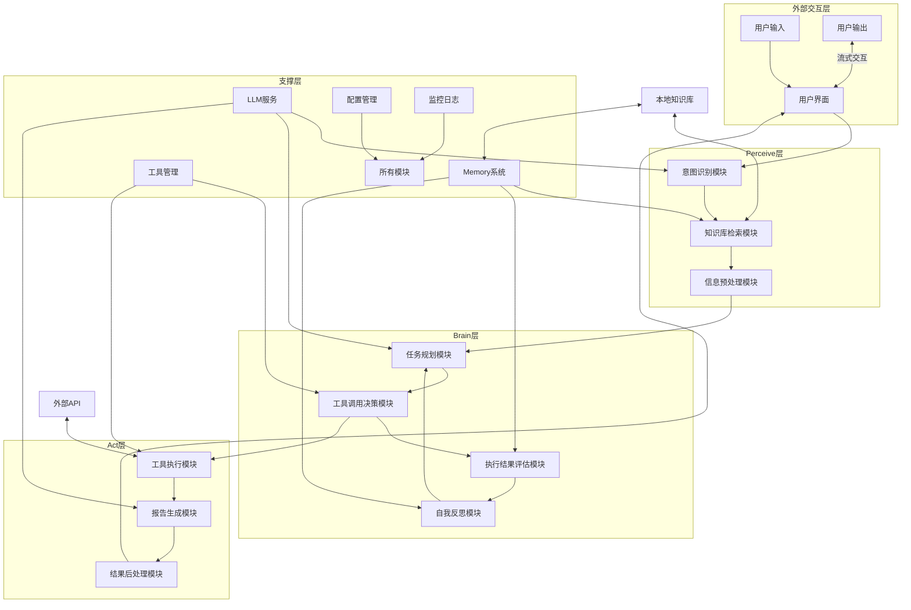

# 个人工作助手 (Personal Work Assistant) 技术需求文档

## 一、系统概述与背景

### 1. 业务价值

本系统作为一个AI驱动的个人工作助手，旨在通过智能化、自动化的方式，显著提升知识工作者的工作效率和输出质量。具体业务价值如下：

- **效率提升**：通过自动化资料搜集、分析和整理，将传统人工处理时间减少80%，使知识工作者能够将更多精力集中在创造性工作上
- **专业输出**：基于预定义的行业标准模板，生成结构完整、内容专业的报告，提高报告质量和一致性
- **智能交互**：支持多轮对话式交互，实现对报告内容的精准修改、扩展和定制，满足个性化需求
- **知识管理**：通过本地知识库的构建和管理，实现信息的有效存储、检索和复用，提升组织知识资产的价值
- **决策支持**：通过对多源信息的整合和分析，为用户提供更全面、准确的决策依据

### 2. 目标用户

系统针对以下几类用户群体，满足其特定的工作需求：

- **职场新人**：刚入职的员工，需要快速了解行业动态、公司业务和竞争对手情况，为团队提供有价值的分析和建议
- **中层管理者**：需要高效生成每周工作总结、下周计划、月度业务报告等，以便及时向上级汇报和向下属传达
- **研究人员**：需要快速收集、分析和整合大量行业信息，生成结构化的研究报告，为决策提供支持
- **自由职业者**：需要高效处理各种文档工作，如生成项目提案、合同、进度报告等，提升专业形象和工作效率
- **学生**：需要撰写课程论文、研究报告和作业，收集和整理相关资料，提高学习效率和成果质量

### 3. 系统定位

系统定位于一个集成化、智能化的个人工作助手，区别于以下几类产品：

- **区别于传统办公软件**：如Microsoft Office，虽然功能强大，但主要依赖手动操作，缺乏智能分析和自动化处理能力
- **区别于AI写作工具**：如ChatGPT，虽然能够生成内容，但缺乏系统化的工作流程管理和知识资产积累能力
- **区别于专业报告工具**：如PowerBI，虽然专注于数据可视化，但缺乏文本分析和自然语言生成能力
- **区别于知识管理系统**：如Notion，虽然提供知识存储和组织功能，但缺乏智能分析和报告自动生成能力
- **区别于RPA工具**：RPA依赖规则化流程，难以处理模糊指令和异常情况，而本系统通过AI Agent能够灵活应对各种复杂场景

### 4. 核心目标

系统的核心目标是提供一个高效、智能、可靠的个人工作助手，具体指标如下：

- **任务完成准确率**：≥85%，确保生成的内容符合用户需求和专业标准
- **响应时间**：平均响应时间<3秒，确保用户获得流畅的交互体验
- **单任务处理**：端到端耗时≤90秒，确保任务能够快速完成
- **流式交互**：事件延迟<2秒/事件，确保用户能够实时看到处理进度
- **知识库检索**：响应时间≤500ms，确保知识获取的及时性
- **报告生成**：成功率≥85%，确保系统能够稳定生成符合要求的报告
- **相关性判断**：准确率≥85%，确保系统能够准确识别和处理与任务相关的信息

### 5. 系统愿景

系统的长期愿景是成为知识工作者的首选智能助手，通过不断的技术创新和功能迭代，实现以下目标：

- 构建一个全方位的知识管理和利用体系，实现个人和组织知识资产的最大化价值
- 提供高度个性化的工作流程自动化方案，适应不同行业和场景的需求
- 成为AI与人类协作的典范，通过人机协同提升工作效率和创造力
- 建立一个开放的生态系统，支持第三方集成和扩展，不断丰富系统功能

## 二、系统架构全景

### 1. 架构设计原则

系统采用Perceive-Brain-Act三层架构设计，遵循以下核心原则：

- **模块化设计**：将系统划分为独立的功能模块，便于开发、测试和维护
- **松耦合高内聚**：模块之间通过标准化接口通信，降低耦合度，提高模块内聚性
- **可扩展性**：架构设计支持功能的横向扩展和纵向深化
- **可靠性**：通过冗余设计和错误处理机制，确保系统稳定运行
- **安全性**：在架构层面考虑安全因素，确保数据和操作的安全性
- **可观测性**：提供全面的监控和日志记录，便于问题定位和性能优化

### 2. 整体架构图



### 3. 核心模块划分与职责

#### Perceive层
- **意图识别模块**：负责分析用户输入的任务描述，识别用户的真实意图和具体需求
- **知识库检索模块**：根据用户意图，从本地知识库中检索相关信息
- **信息预处理模块**：对检索到的信息进行清洗、整合和标准化处理，为后续分析做准备

#### Brain层
- **任务规划模块**：基于用户意图和检索到的信息，拆解任务步骤，制定详细的执行计划
- **工具调用决策模块**：根据执行计划，决策需要调用哪些工具来完成任务
- **执行结果评估模块**：评估工具执行的结果，判断是否满足任务需求
- **自我反思模块**：根据执行结果和评估，反思执行过程中的问题，调整后续执行策略

#### Act层
- **工具执行模块**：调用外部工具（如搜索API）获取信息，执行具体操作
- **报告生成模块**：基于获取的信息和用户需求，生成结构化的报告
- **结果后处理模块**：对生成的报告进行格式化、美化和质量检查

#### 支撑层
- **LLM服务**：提供核心的自然语言理解和生成能力，支持各个模块的AI任务
- **Memory系统**：管理短期对话上下文和长期知识库，支持信息的存储和检索
- **工具管理**：管理系统可调用的各种工具，包括工具注册、调用和监控
- **配置管理**：管理系统的各种配置参数，支持动态调整
- **监控日志**：监控系统的运行状态，记录操作日志和错误信息

### 4. 数据流与交互

系统的典型数据流和交互过程如下：

1. **用户输入**：用户通过界面输入任务描述
2. **意图识别**：Perceive层分析用户输入，识别任务意图
3. **知识检索**：从本地知识库中检索相关信息
4. **任务规划**：Brain层根据意图和检索结果，制定执行计划
5. **工具调用**：根据执行计划，调用相应的工具获取信息
6. **结果评估**：评估工具执行结果，判断是否满足需求
7. **自我反思**：反思执行过程，调整策略
8. **报告生成**：Act层基于获取的信息生成结构化报告
9. **流式输出**：将生成的报告通过流式交互展示给用户
10. **用户反馈**：用户对报告进行评价或提出修改建议
11. **循环迭代**：根据用户反馈，重复上述过程，直至满足用户需求

### 5. 系统边界

#### 功能边界
- **能做的**：
  - 自动拆解任务步骤，制定执行计划
  - 调用搜索工具获取外部资料
  - 验证信息的可靠性和相关性
  - 基于模板生成结构化报告
  - 支持多轮对话协作，实现精准修改
  - 管理本地知识库，支持文档上传和检索
  - 提供流式交互体验，实时展示处理进度

- **不能做的**：
  - 自动执行金融交易等需要人工授权的操作
  - 处理涉及个人隐私的敏感信息
  - 完全替代人工的专业判断和决策
  - 执行需要物理操作的任务
  - 处理超出其知识范围的高度专业问题

#### 技术边界
- **性能边界**：支持最多100个并发用户，单任务处理时间不超过90秒
- **数据边界**：本地知识库支持最多10万条文档，向量存储支持最多100万条向量
- **可靠性边界**：系统可用性目标为99.9%，故障恢复时间不超过5分钟

### 6. 架构优势

- **层次清晰**：Perceive-Brain-Act三层架构清晰反映了系统的认知和执行过程
- **灵活性强**：模块化设计使得系统能够灵活适应不同的任务场景
- **可扩展性好**：支撑层的设计为系统功能的扩展提供了良好的基础
- **智能度高**：自我反思机制使得系统能够不断学习和改进
- **用户体验佳**：流式交互和实时反馈提升了用户体验

## 三、核心模块技术需求

### 1. LLM（语言模型）服务需求

#### 1.1 技术选型
- **核心LLM**：使用DeepSeek API v1.5作为主要语言模型，支持多语言处理和专业内容生成
- **备选方案**：集成Ollama API v0.1.26作为本地模型备选，用于处理敏感数据和离线场景
- **嵌入模型**：使用nomic-embed-text模型进行文本嵌入，支持语义搜索

#### 1.2 性能指标
- **响应时间**：平均响应时间<3秒，95%分位响应时间<5秒
- **准确率**：任务完成准确率≥85%，信息提取准确率≥90%
- **并发能力**：支持≥10个并发任务，峰值可扩展至≥100个并发
- **吞吐量**：每秒可处理≥5个请求

#### 1.3 实现方案
- **API集成**：使用RESTful API与DeepSeek和Ollama进行交互
- **请求优化**：实现请求批处理和缓存机制，减少API调用次数
- **参数调优**：针对不同任务类型，优化temperature、top_p等参数
- **故障转移**：当主模型不可用时，自动切换到备选模型

#### 1.4 更新与管理
- **版本管理**：建立模型版本管理机制，记录每个版本的性能指标
- **迭代计划**：每季度评估一次模型性能，根据需要更新模型版本
- **回滚策略**：当新模型版本出现问题时，能在5分钟内回滚到之前的稳定版本
- **监控机制**：实时监控模型响应时间、准确率和可用性

### 2. Memory（记忆系统）需求

#### 2.1 技术选型
- **向量数据库**：使用ChromaDB作为向量存储，支持元数据过滤和相似性搜索
- **存储引擎**：本地文件系统存储，支持加密和压缩
- **缓存机制**：使用Redis作为热点数据缓存，提高检索速度

#### 2.2 短期记忆
- **管理策略**：基于LLM上下文窗口大小，动态调整对话历史保留长度
- **摘要机制**：当对话超过5000token时，自动生成对话摘要，保留关键信息
- **保留策略**：最多保留10轮对话上下文，每轮对话最多保留500token
- **存储方式**：内存存储，会话结束后可选持久化

#### 2.3 长期记忆
- **存储策略**：本地存储，支持万级文档存储，单个文档大小上限为100MB
- **组织方式**：按文档类型、主题、时间等维度进行分类和索引
- **备份机制**：自动定期备份，支持增量备份和全量备份
- **清理策略**：实现基于使用频率和时间的自动清理机制

#### 2.4 记忆检索
- **检索策略**：使用语义相似度搜索，结合元数据过滤和关键词匹配
- **准确率要求**：关键信息检索准确率≥90%，相关信息召回率≥85%
- **响应时间**：检索响应时间≤500ms，复杂查询≤1s
- **优化策略**：实现检索结果排序和重排机制，提高相关性

#### 2.5 记忆更新
- **数据清洗**：去除重复信息，过滤不相关内容，处理噪声数据
- **分段策略**：文本分块大小500token，重叠50token，确保上下文连续性
- **打标规范**：按文档类型、主题、来源、时间等维度进行自动打标
- **嵌入生成**：使用nomic-embed-text模型生成向量嵌入，维度为768

### 3. 任务规划模块需求

#### 3.1 技术选型
- **规划算法**：采用ReAct模式，结合思维链(CoT)和思维树(ToT)方法
- **实现框架**：使用LangGraph框架实现任务规划和执行流程
- **评估机制**：基于预期结果与实际结果的相似度进行评估

#### 3.2 实现方案
- **任务分解**：将复杂任务分解为可执行的子任务序列，每个子任务有明确的输入和输出
- **计划生成**：基于用户意图和可用信息，生成详细的执行计划，包括工具使用、步骤顺序等
- **动态调整**：在执行过程中，根据实时反馈动态调整执行计划
- **优先级管理**：实现任务优先级机制，确保重要任务优先执行

#### 3.3 失败处理
- **回退策略**：当任务执行失败时，记录失败原因，尝试替代方案
- **重试机制**：实现智能重试策略，最多重试3次，每次间隔5秒，避免无效重试
- **异常处理**：针对网络错误、API错误、参数错误等不同类型的异常，实现专门的处理逻辑
- **降级方案**：当系统资源不足时，启用降级方案，保证核心功能可用

#### 3.4 评估标准
- **任务分解完整性**：子任务覆盖主任务需求的比例≥85%
- **执行成功率**：任务执行成功率≥80%
- **计划合理性**：执行计划的步骤顺序和工具选择合理性≥90%
- **资源利用率**：任务执行的资源利用率≥70%

### 4. 工具调用模块需求

#### 4.1 工具列表
- **搜索工具**：集成Exa API，用于获取外部最新信息
- **知识库工具**：实现本地知识库的检索和管理功能
- **文档解析工具**：支持PDF、DOCX、TXT、MD等多种格式文档的解析
- **报告生成工具**：基于预定义模板生成结构化报告
- **数据处理工具**：实现数据清洗、转换和分析功能

#### 4.2 技术实现
- **API规范**：使用OpenAI Function Calling格式作为工具调用标准
- **工具注册**：实现工具注册机制，支持动态添加和管理工具
- **参数验证**：实现工具参数的自动验证和转换
- **执行管理**：实现工具执行的异步管理和超时控制

#### 4.3 错误处理
- **失败重试**：针对网络错误等临时性问题，实现自动重试机制，最多重试3次
- **错误分类**：将错误分为网络错误、API错误、参数错误、权限错误等类型
- **处理策略**：根据错误类型，采取不同的处理策略，如重试、降级、提示用户等
- **错误记录**：详细记录工具调用错误，用于后续分析和优化

#### 4.4 安全控制
- **权限管理**：基于用户角色的权限控制，限制工具的使用范围
- **安全审计**：记录所有工具调用操作，包括调用者、时间、参数、结果等
- **输入验证**：对工具输入参数进行严格验证，防止注入攻击
- **输出过滤**：对工具输出结果进行过滤，去除敏感信息

### 5. 自我反思模块需求

#### 5.1 技术实现
- **评估机制**：基于任务完成度、信息准确性、用户满意度等指标，评估执行效果
- **反思算法**：使用基于规则和机器学习相结合的方法，分析执行过程中的问题
- **反馈收集**：实现用户反馈收集机制，获取用户对执行结果的评价
- **学习机制**：基于历史执行数据和反馈，不断优化反思模型

#### 5.2 策略调整
- **任务规划调整**：当任务完成度低于70%时，重新规划任务，调整执行步骤
- **信息验证增强**：当信息准确性低于80%时，增加信息验证步骤，提高信息可靠性
- **生成策略优化**：当用户满意度低于75%时，调整报告生成策略，改善输出质量
- **工具选择优化**：基于历史执行数据，优化工具选择和参数设置

#### 5.3 反思频率
- **实时反思**：每次任务执行后，进行轻量级反思，调整后续执行策略
- **定期反思**：每完成10个任务，进行一次深度反思，总结经验教训
- **批量反思**：每天对当天所有任务执行情况进行批量分析，优化系统参数

#### 5.4 反思结果应用
- **策略更新**：将反思结果转化为具体的策略更新，应用到系统中
- **知识库优化**：基于反思结果，优化知识库的组织和检索策略
- **工具改进**：根据反思结果，改进工具调用逻辑和参数设置
- **报告模板优化**：基于用户反馈，优化报告模板，提高生成质量

### 6. 报告生成模块需求

#### 6.1 技术实现
- **模板系统**：实现基于Markdown和HTML的模板系统，支持自定义和扩展
- **内容生成**：使用LLM生成结构化报告内容，确保逻辑清晰和专业准确
- **格式处理**：实现报告的格式化、美化和导出功能
- **质量检查**：自动检查报告的结构完整性、内容相关性和语言流畅性

#### 6.2 功能需求
- **模板管理**：提供8种预定义报告模板，支持模板的创建、编辑和管理
- **内容定制**：支持用户对报告内容进行定制和修改
- **多格式导出**：支持PDF、Word、HTML等多种格式的导出
- **版本控制**：实现报告的版本控制，支持历史版本查看和恢复

#### 6.3 性能指标
- **生成速度**：标准报告生成时间≤30秒，复杂报告≤60秒
- **模板应用准确率**：模板应用准确率≥95%
- **内容质量**：报告内容质量评分≥85分（满分100分）
- **用户满意度**：报告生成用户满意度≥80%

### 7. 监控与日志模块需求

#### 7.1 技术选型
- **监控系统**：使用Prometheus和Grafana实现系统监控
- **日志系统**：使用ELK Stack（Elasticsearch、Logstash、Kibana）实现日志管理
- **告警机制**：实现基于阈值的告警机制，及时发现和处理问题

#### 7.2 监控指标
- **系统指标**：CPU使用率、内存使用率、磁盘使用率、网络带宽
- **服务指标**：API响应时间、请求成功率、并发数
- **业务指标**：任务完成率、用户满意度、报告生成质量

#### 7.3 日志管理
- **日志格式**：使用JSON格式记录日志，包含时间戳、级别、模块、消息等字段
- **存储策略**：系统日志保留30天，业务日志保留90天
- **分析功能**：支持日志查询、过滤、聚合和可视化分析
- **审计跟踪**：实现关键操作的审计跟踪，确保操作可追溯

## 四、系统接口需求

### 1. 输入接口

#### 1.1 用户输入接口
- **输入方式**：
  - 文本输入框：支持多行文本输入
  - 文件上传：支持PDF、DOCX、TXT、MD等格式文件上传
  - 语音输入：可选功能，支持语音转文本

- **输入格式**：
  - 文本输入：支持纯文本和Markdown格式
  - 文件格式：支持PDF、DOCX、TXT、MD等常见文档格式
  - 最大文件大小：100MB

- **内容规范**：
  - 任务描述：≤5000字符
  - 支持语言：中文、英文
  - 特殊字符：支持常见标点符号和特殊字符

- **预处理要求**：
  - 文本清洗：去除多余空白字符，标准化标点符号
  - 长度检测：检测输入长度，超过限制时提示用户
  - 格式验证：验证文件格式是否支持，文件大小是否符合要求
  - 安全检查：检测输入内容和上传文件的安全性，防止恶意代码

#### 1.2 系统内部输入接口
- **模块间调用接口**：
  - 采用标准化的函数调用接口，使用Python对象传递数据
  - 支持同步和异步调用方式
  - 提供详细的接口文档和类型提示

- **配置输入接口**：
  - 支持配置文件输入（JSON、YAML格式）
  - 支持环境变量配置
  - 支持运行时动态配置调整

### 2. 输出接口

#### 2.1 用户输出接口
- **输出方式**：
  - 流式文本输出：实时显示处理进度和结果
  - 文件下载：支持PDF、Word、HTML、Markdown等格式
  - 邮件发送：可选功能，支持将结果发送到指定邮箱

- **输出格式**：
  - 文本格式：支持纯文本和Markdown格式
  - 文档格式：支持PDF、Word、HTML等常见文档格式
  - 数据格式：支持JSON、CSV等数据交换格式

- **内容规范**：
  - 结构化报告：包含标题、摘要、正文、结论等完整结构
  - 清晰的章节划分：使用适当的标题层级
  - 适当的引用和注释：标明信息来源
  - 语言规范：语法正确，表达流畅

- **展示方式**：
  - 实时流式显示：逐句显示生成内容
  - 富文本展示：支持代码高亮、表格、列表、图片等
  - 响应式设计：适配不同屏幕尺寸
  - 交互元素：支持复制、分享、反馈等操作

#### 2.2 系统内部输出接口
- **模块间返回接口**：
  - 标准化的返回格式，包含状态码、消息、数据
  - 支持异常处理和错误返回
  - 提供详细的返回值文档

- **日志输出接口**：
  - 标准化的日志格式（JSON格式）
  - 支持不同级别的日志输出（DEBUG、INFO、WARN、ERROR）
  - 支持日志的结构化和非结构化输出

### 3. 外部系统集成

#### 3.1 API集成
- **搜索API**：
  - 集成Exa API：用于获取外部最新信息
  - 接口规范：遵循Exa API的RESTful接口规范
  - 认证方式：API密钥认证
  - 错误处理：实现API调用失败的重试和降级策略

- **LLM API**：
  - 集成DeepSeek API v1.5：作为主要语言模型
  - 集成Ollama API v0.1.26：作为本地模型备选
  - 接口规范：遵循各API的RESTful接口规范
  - 认证方式：API密钥认证（DeepSeek），本地认证（Ollama）
  - 错误处理：实现模型切换和故障转移机制

#### 3.2 知识库集成
- **文档解析**：
  - 集成PyPDF2、python-docx等库，支持PDF、DOCX等格式解析
  - 解析结果：提取文本内容、表格、图片等元素
  - 错误处理：处理解析失败的情况，提供友好的错误提示

- **向量数据库**：
  - 集成ChromaDB：作为向量存储
  - 接口规范：使用ChromaDB的Python SDK
  - 操作支持：支持向量的添加、查询、更新、删除
  - 性能优化：实现批量操作和缓存机制

#### 3.3 第三方服务集成
- **存储服务**：
  - 支持本地文件系统存储
  - 可选集成云存储服务（如AWS S3、阿里云OSS）
  - 接口规范：遵循各存储服务的API规范

- **通知服务**：
  - 可选集成邮件服务：用于发送报告和通知
  - 可选集成消息推送服务：用于实时通知
  - 接口规范：遵循各通知服务的API规范

### 4. 数据交换格式

#### 4.1 内部数据交换
- **模块间数据交换**：
  - 核心数据结构：使用Python字典和对象
  - 序列化格式：使用JSON或MessagePack格式
  - 数据传输：支持同步调用和异步消息队列

- **配置数据格式**：
  - 配置文件：使用JSON或YAML格式
  - 环境变量：使用键值对格式
  - 配置管理：实现配置的版本控制和变更追踪

#### 4.2 外部API交互
- **请求格式**：
  - 标准格式：JSON格式
  - 内容类型：application/json
  - 编码：UTF-8

- **响应格式**：
  - 标准格式：JSON格式
  - 结构：包含状态码、消息、数据字段
  - 错误处理：统一的错误响应格式

#### 4.3 文件存储格式
- **文档存储**：
  - 原始文档：保持原始格式存储
  - 解析结果：存储为Markdown或JSON格式
  - 压缩存储：对大型文档进行压缩存储

- **向量数据存储**：
  - 存储格式：ChromaDB存储格式
  - 索引结构：基于向量相似度的索引
  - 备份策略：定期备份向量数据

- **元数据存储**：
  - 存储格式：JSON格式
  - 内容：包含文档类型、主题、来源、时间、摘要等信息
  - 索引：基于元数据字段的索引

#### 4.4 数据模型定义

##### 4.4.1 任务数据模型
```json
{
  "task_id": "uuid",
  "user_id": "string",
  "task_type": "string",
  "input": "string",
  "files": [
    {
      "file_id": "uuid",
      "file_name": "string",
      "file_path": "string",
      "file_type": "string",
      "file_size": "number"
    }
  ],
  "status": "pending|in_progress|completed|failed",
  "result": "string",
  "error": "string",
  "created_at": "timestamp",
  "updated_at": "timestamp"
}
```

##### 4.4.2 知识库文档模型
```json
{
  "doc_id": "uuid",
  "doc_name": "string",
  "doc_type": "string",
  "doc_path": "string",
  "doc_size": "number",
  "content": "string",
  "embedding": "array",
  "metadata": {
    "author": "string",
    "created_date": "date",
    "tags": ["string"],
    "summary": "string"
  },
  "created_at": "timestamp",
  "updated_at": "timestamp"
}
```

##### 4.4.3 报告模板模型
```json
{
  "template_id": "uuid",
  "template_name": "string",
  "template_type": "string",
  "content": "string",
  "variables": [
    {
      "name": "string",
      "type": "string",
      "required": "boolean",
      "default": "any"
    }
  ],
  "created_at": "timestamp",
  "updated_at": "timestamp"
}
```

## 五、性能与质量需求

### 1. 响应时间

#### 1.1 核心指标
- **平均响应时间**：<3秒
- **95%分位响应时间**：<5秒
- **99%分位响应时间**：<8秒
- **知识库检索**：响应时间≤500ms
- **流式交互**：事件延迟<2秒/事件
- **单任务处理**：端到端耗时≤90秒

#### 1.2 测试方法
- **负载测试**：使用JMeter或Locust模拟多用户并发请求，测试系统在不同负载下的响应时间
- **基准测试**：定期执行基准测试，记录系统响应时间的变化趋势
- **监控方法**：使用Prometheus和Grafana实时监控系统响应时间，设置阈值告警

#### 1.3 优化策略
- **缓存机制**：实现多级缓存，缓存热点数据和计算结果
- **异步处理**：将耗时操作异步化，提高系统响应速度
- **负载均衡**：在多实例部署时，实现负载均衡，合理分配请求
- **资源优化**：优化数据库查询、API调用和计算逻辑，减少响应时间

### 2. 准确率

#### 2.1 核心指标
- **任务完成准确率**：≥85%
- **信息检索准确率**：≥90%
- **信息提取准确率**：≥88%
- **报告质量**：
  - 结构完整性≥90%
  - 内容相关性≥85%
  - 语言流畅性≥90%
- **幻觉率**：≤10%

#### 2.2 测试方法
- **人工评估**：由领域专家对系统生成的结果进行评估，计算准确率
- **自动测试**：使用预设的测试用例，自动计算系统的准确率
- **对比测试**：与人工生成的结果或其他系统的结果进行对比，评估准确率
- **用户反馈**：收集用户对系统结果的反馈，作为准确率评估的补充

#### 2.3 优化策略
- **模型调优**：持续优化LLM的参数设置，提高生成质量
- **多源验证**：对重要信息进行多源验证，提高信息准确性
- **后处理**：对生成结果进行后处理，修正明显错误
- **反馈学习**：基于用户反馈，持续优化系统的生成策略

### 3. 可用性

#### 3.1 核心指标
- **系统可用性目标**：99.9%
- **故障恢复时间**：<5分钟
- **计划内维护时间**：每周一次，每次≤30分钟
- **系统稳定性**：连续运行72小时无故障

#### 3.2 测试方法
- **故障注入测试**：模拟各种故障场景，测试系统的恢复能力
- **长时间运行测试**：让系统连续运行72小时以上，观察系统稳定性
- **冗余测试**：测试系统在部分组件故障时的可用性

#### 3.3 优化策略
- **冗余设计**：关键组件采用冗余设计，提高系统可用性
- **自动恢复**：实现自动故障检测和恢复机制
- **监控告警**：建立完善的监控和告警机制，及时发现和处理问题
- **灾难恢复**：制定详细的灾难恢复计划，定期演练

### 4. 扩展性

#### 4.1 核心指标
- **支持的并发用户数**：≥100
- **峰值并发用户数**：≥500
- **数据量扩展能力**：
  - 知识库容量：支持≥10万条文档
  - 向量存储：支持≥100万条向量
  - 历史任务：支持≥100万条任务记录

#### 4.2 测试方法
- **扩展性测试**：逐步增加用户数量和数据量，测试系统的扩展能力
- **极限测试**：测试系统在极限负载下的表现
- **容量规划**：基于测试结果，制定系统容量规划

#### 4.3 优化策略
- **水平扩展**：支持通过增加实例数量来扩展系统容量
- **垂直扩展**：支持通过增加硬件资源来提高单实例性能
- **资源隔离**：实现资源隔离，避免单个任务占用过多资源
- **弹性伸缩**：基于负载自动调整系统资源，提高资源利用率

### 5. 质量保证

#### 5.1 测试策略
- **单元测试**：对每个模块进行单元测试，确保模块功能正确
- **集成测试**：测试模块之间的集成，确保系统整体功能正常
- **端到端测试**：测试完整的用户流程，确保系统满足用户需求
- **回归测试**：每次代码变更后，执行回归测试，确保不引入新问题

#### 5.2 测试工具
- **测试框架**：使用pytest进行单元测试和集成测试
- **自动化测试**：使用Selenium或Playwright进行端到端自动化测试
- **性能测试**：使用JMeter或Locust进行性能测试
- **代码质量**：使用flake8、pylint等工具进行代码质量检查

#### 5.3 质量指标
- **测试覆盖率**：代码测试覆盖率≥80%
- **缺陷密度**：每千行代码缺陷数≤5
- **问题解决时间**：严重问题解决时间≤24小时，一般问题解决时间≤72小时
- **用户满意度**：用户满意度≥85%

#### 5.4 持续集成与持续部署
- **CI/CD流程**：建立完善的CI/CD流程，确保代码质量和快速部署
- **自动化测试**：在CI/CD流程中集成自动化测试，确保每次部署的质量
- **部署策略**：采用蓝绿部署或滚动部署，减少部署对用户的影响
- **回滚机制**：实现快速回滚机制，当部署出现问题时能够及时回滚

## 六、安全与合规需求

### 1. 数据安全

#### 1.1 数据加密
- **传输加密**：
  - 使用TLS 1.3协议进行数据传输加密
  - 配置强密码套件，禁用弱加密算法
  - 定期更新SSL/TLS证书

- **存储加密**：
  - 敏感数据使用AES-256算法加密存储
  - 密钥管理：使用密钥管理服务（KMS）安全管理加密密钥
  - 分级加密：根据数据敏感度采用不同强度的加密策略

- **应用层加密**：
  - 密码等敏感信息在应用层进行加密处理
  - API密钥等凭证信息加密存储

#### 1.2 传输安全
- **API安全**：
  - 使用RESTful API时，实现API密钥认证和请求签名
  - 设置合理的API请求速率限制，防止暴力攻击
  - 实现API请求的防重放机制

- **网络安全**：
  - 配置防火墙，限制网络访问范围
  - 实现网络隔离，将不同安全级别的系统分离
  - 定期进行网络安全扫描，发现并修复漏洞

#### 1.3 存储安全
- **权限控制**：
  - 实现基于角色的访问控制（RBAC），细粒度管理用户权限
  - 遵循最小权限原则，只授予用户必要的权限
  - 定期 review 和更新权限设置

- **数据备份与恢复**：
  - 制定完善的数据备份策略，包括全量备份和增量备份
  - 备份数据加密存储，并存储在不同物理位置
  - 定期测试数据恢复流程，确保备份数据的可用性

- **数据销毁**：
  - 制定数据销毁策略，确保不再需要的数据被安全销毁
  - 对存储介质进行安全擦除，防止数据泄露

### 2. 隐私保护

#### 2.1 用户数据保护
- **数据匿名化**：
  - 不存储用户身份信息，使用匿名标识符
  - 会话数据加密存储，会话结束后可选择性删除
  - 日志中的用户标识信息进行匿名化处理

- **脱敏处理**：
  - 实现敏感信息检测和过滤机制，自动识别并处理敏感信息
  - 对个人隐私数据（如姓名、邮箱、电话等）进行脱敏处理
  - 制定脱敏处理规范，确保脱敏后的数据不影响系统功能

- **数据最小化**：
  - 遵循数据最小化原则，只收集和存储必要的数据
  - 定期清理不再需要的数据，减少数据泄露风险

#### 2.2 用户权利保障
- **数据访问权**：
  - 用户有权访问自己的个人数据
  - 提供用户数据访问接口，确保用户能够查看自己的数据

- **数据修改权**：
  - 用户有权修改自己的个人数据
  - 提供数据修改机制，确保用户能够更新自己的数据

- **数据删除权**：
  - 用户有权删除自己的个人数据
  - 提供数据删除机制，确保用户能够删除自己的数据
  - 实现数据删除的审计跟踪，确保删除操作可追溯

- **数据导出权**：
  - 用户有权导出自己的个人数据
  - 提供数据导出功能，支持常见的数据格式

### 3. 合规性

#### 3.1 法规合规
- **GDPR合规**：
  - 制定并公开隐私政策，明确数据处理方式
  - 获得用户对数据处理的明确 consent
  - 实现数据主体权利保障机制
  - 建立数据保护影响评估（DPIA）流程

- **网络安全法合规**：
  - 实现数据本地化存储，确保数据存储在中国境内
  - 定期进行安全评估和认证
  - 建立网络安全事件应急响应机制

- **其他法规合规**：
  - 符合《个人信息保护法》的要求
  - 符合行业特定的法规要求（如金融、医疗等）

#### 3.2 行业标准
- **安全认证**：
  - 争取获得ISO 27001信息安全管理体系认证
  - 争取获得等保三级认证
  - 定期进行安全评估和渗透测试

- **最佳实践**：
  - 遵循OWASP Top 10安全最佳实践
  - 采用安全开发生命周期（SDLC）方法
  - 定期更新安全措施，适应新的安全威胁

### 4. 安全审计与监控

#### 4.1 安全事件记录
- **日志记录**：
  - 记录所有系统操作，包括用户操作、管理员操作和系统自动操作
  - 记录所有API调用，包括调用方、时间、参数和结果
  - 日志数据加密存储，确保日志数据的完整性和安全性

- **审计跟踪**：
  - 实现关键操作的审计跟踪，确保操作可追溯
  - 审计日志至少保留90天，重要审计日志长期保留
  - 定期分析审计日志，发现异常行为

#### 4.2 监控与告警
- **实时监控**：
  - 实时监控系统状态，包括CPU、内存、磁盘等资源使用情况
  - 实时监控网络流量，发现异常流量
  - 实时监控API调用，发现异常调用

- **告警机制**：
  - 设置合理的告警阈值，当指标超过阈值时触发告警
  - 实现多级告警，根据告警严重程度采取不同的响应措施
  - 建立告警响应流程，确保告警能够及时处理

- **安全扫描**：
  - 定期进行漏洞扫描，发现并修复系统漏洞
  - 定期进行代码安全扫描，发现并修复代码中的安全问题
  - 定期进行依赖库安全扫描，发现并更新有安全漏洞的依赖库

#### 4.3 安全事件响应
- **应急响应**：
  - 建立安全事件应急响应团队，明确团队成员职责
  - 制定安全事件应急响应计划，包括事件检测、响应、恢复等流程
  - 定期演练应急响应计划，确保团队能够快速有效地应对安全事件

- **事件报告**：
  - 建立安全事件报告机制，及时向上级和相关部门报告安全事件
  - 记录安全事件的详细信息，包括事件发生时间、影响范围、处理过程等
  - 分析安全事件原因，提出改进措施，防止类似事件再次发生

### 5. 安全开发与运维

#### 5.1 安全开发
- **安全编码规范**：
  - 制定安全编码规范，指导开发人员编写安全的代码
  - 定期对开发人员进行安全编码培训
  - 使用代码安全扫描工具，发现并修复代码中的安全问题

- **第三方依赖管理**：
  - 建立第三方依赖库管理机制，定期更新有安全漏洞的依赖库
  - 对引入的第三方依赖库进行安全评估，确保其安全性
  - 维护依赖库清单，记录依赖库的版本和安全状态

#### 5.2 安全运维
- **配置管理**：
  - 建立配置管理机制，确保系统配置的一致性和安全性
  - 对敏感配置信息进行加密存储
  - 定期 review 系统配置，发现并修复安全问题

- **变更管理**：
  - 建立变更管理机制，确保系统变更的安全性和可追溯性
  - 对变更进行风险评估，制定相应的风险缓解措施
  - 记录变更的详细信息，包括变更内容、执行时间、执行人员等

- **访问管理**：
  - 建立严格的访问管理机制，控制对系统和数据的访问
  - 实现多因素认证，提高认证安全性
  - 定期 review 访问权限，及时撤销不再需要的权限

## 七、部署与运维需求

### 1. 部署环境

#### 1.1 硬件要求
- **最低配置**：
  - CPU：4核（Intel i5或同等性能）
  - 内存：8GB
  - 存储：50GB SSD
  - 网络：100Mbps以上

- **推荐配置**：
  - CPU：8核（Intel i7或同等性能）
  - 内存：16GB
  - 存储：100GB SSD
  - 网络：1Gbps以上

- **服务器配置**：
  - CPU：16核或以上
  - 内存：32GB或以上
  - 存储：500GB SSD或以上
  - 网络：1Gbps以上

#### 1.2 软件环境
- **操作系统**：
  - Windows：Windows 10/11（64位）
  - Linux：Ubuntu 20.04+、CentOS 8+（64位）

- **Python环境**：
  - Python 3.9+（推荐3.10）
  - pip 21.0+

- **依赖库**：
  - 核心依赖：FastAPI、LangGraph、ChromaDB、PyPDF2、python-docx
  - 详见requirements.txt文件
  - 依赖管理：使用pipenv或conda进行依赖管理

#### 1.3 云环境
- **支持的云平台**：
  - 阿里云
  - 腾讯云
  - AWS
  - Azure

- **云服务要求**：
  - 计算服务：支持虚拟机或容器服务
  - 存储服务：支持对象存储或块存储
  - 网络服务：支持VPC、负载均衡等
  - 安全服务：支持防火墙、DDoS防护等

### 2. 部署架构

#### 2.1 单机部署
- **适用场景**：开发环境、测试环境、小规模生产环境
- **部署方式**：
  - 直接在物理机或虚拟机上部署
  - 使用Docker容器化部署
- **配置要求**：
  - 配置文件：根据环境修改配置参数
  - 环境变量：设置必要的环境变量

#### 2.2 集群部署
- **适用场景**：大规模生产环境、高可用性要求
- **部署方式**：
  - 使用Kubernetes进行容器编排
  - 配置多节点集群，实现高可用性
- **架构组件**：
  - 负载均衡：分发用户请求
  - 应用节点：运行应用实例
  - 存储节点：存储数据和文件
  - 监控节点：监控系统状态

#### 2.3 容器化部署
- **Docker镜像**：
  - 基于官方Python镜像构建
  - 包含所有必要的依赖库
  - 优化镜像大小，减少部署时间

- **Docker Compose**：
  - 定义多容器应用的配置
  - 支持一键启动和停止服务
  - 适用于开发和测试环境

- **Kubernetes**：
  - 定义部署、服务、持久卷等资源
  - 支持自动扩缩容和滚动更新
  - 适用于生产环境

### 3. 部署流程

#### 3.1 准备工作
- **环境检查**：检查硬件、软件环境是否满足要求
- **依赖安装**：安装必要的依赖库和工具
- **配置准备**：准备配置文件和环境变量
- **网络配置**：配置网络访问权限和防火墙规则

#### 3.2 安装部署
- **源码部署**：
  1. 克隆代码仓库
  2. 创建虚拟环境
  3. 安装依赖
  4. 配置环境变量
  5. 启动服务

- **Docker部署**：
  1. 构建Docker镜像
  2. 运行Docker容器
  3. 配置容器网络
  4. 挂载数据卷

- **Kubernetes部署**：
  1. 构建Docker镜像并推送至镜像仓库
  2. 应用Kubernetes配置文件
  3. 配置服务和 ingress
  4. 验证部署状态

#### 3.3 部署验证
- **功能验证**：测试系统核心功能是否正常
- **性能验证**：测试系统在不同负载下的性能
- **安全验证**：检查系统安全配置是否正确
- **可用性验证**：测试系统的高可用性

### 4. 监控指标

#### 4.1 系统指标
- **资源使用**：
  - CPU使用率：阈值>80%告警
  - 内存使用率：阈值>85%告警
  - 磁盘使用率：阈值>90%告警
  - 网络流量：阈值>带宽的80%告警

- **服务状态**：
  - 服务可用性：阈值<99.9%告警
  - 进程状态：监控关键进程是否运行
  - 端口状态：监控服务端口是否开放

#### 4.2 应用指标
- **性能指标**：
  - 响应时间：平均响应时间>3秒告警
  - 请求成功率：阈值<95%告警
  - 并发数：监控系统并发处理能力
  - 吞吐量：监控系统处理请求的速率

- **业务指标**：
  - 任务完成率：阈值<85%告警
  - 报告生成成功率：阈值<85%告警
  - 知识库使用率：监控知识库的使用情况
  - 用户活跃度：监控系统的用户活跃度

#### 4.3 监控工具
- **监控系统**：
  - Prometheus：收集和存储监控指标
  - Grafana：可视化监控数据，创建仪表盘
  - AlertManager：管理告警规则和通知

- **日志监控**：
  - ELK Stack：收集、存储和分析日志
  - Loki：轻量级日志聚合系统
  - Fluentd：日志收集和转发

- **APM工具**：
  - Jaeger：分布式追踪
  - Zipkin：分布式追踪
  - OpenTelemetry：统一可观测性框架

### 5. 日志管理

#### 5.1 日志类型
- **系统日志**：记录操作系统和基础设施相关的事件
- **应用日志**：记录应用程序的运行状态和错误信息
- **业务日志**：记录业务操作和用户行为
- **安全日志**：记录安全相关的事件和审计信息

#### 5.2 日志格式
- **标准格式**：
  - 使用JSON格式，确保日志结构化
  - 包含时间戳、日志级别、模块名称、消息内容等字段
  - 支持自定义字段，如请求ID、用户ID等

- **日志级别**：
  - DEBUG：详细的调试信息
  - INFO：一般的信息性消息
  - WARN：警告信息
  - ERROR：错误信息
  - FATAL：致命错误信息

#### 5.3 日志存储
- **存储策略**：
  - 系统日志：保留30天
  - 应用日志：保留60天
  - 业务日志：保留90天
  - 安全日志：保留180天

- **存储方式**：
  - 本地存储：使用旋转日志文件
  - 集中存储：使用ELK Stack或Loki
  - 备份策略：定期备份日志数据

#### 5.4 日志分析
- **分析工具**：
  - Kibana：可视化和分析日志数据
  - Grafana：创建日志分析仪表盘
  - 自定义脚本：针对特定场景的日志分析

- **分析场景**：
  - 故障排查：通过日志定位系统故障
  - 性能分析：分析系统性能瓶颈
  - 安全审计：检测和分析安全事件
  - 业务分析：分析用户行为和业务趋势

### 6. 自动化运维

#### 6.1 部署自动化
- **CI/CD流程**：
  - 代码提交：触发CI流程
  - 自动测试：执行单元测试和集成测试
  - 构建部署：构建应用并部署到测试环境
  - 验收测试：执行验收测试
  - 生产部署：部署到生产环境

- **CI/CD工具**：
  - Jenkins：开源CI/CD工具
  - GitLab CI：集成在GitLab中的CI/CD工具
  - GitHub Actions：GitHub提供的CI/CD服务
  - CircleCI：云端CI/CD服务

#### 6.2 配置管理
- **配置管理工具**：
  - Ansible：自动化配置管理
  - Puppet：配置管理和自动化
  - Chef：配置管理和自动化

- **配置版本控制**：
  - 使用Git管理配置文件
  - 配置变更的审计和回滚
  - 环境隔离：不同环境使用不同的配置

#### 6.3 扩缩容机制
- **自动扩缩容**：
  - 基于CPU使用率自动扩缩容
  - 基于内存使用率自动扩缩容
  - 基于请求量自动扩缩容

- **手动扩缩容**：
  - 提供管理界面，支持手动调整资源
  - 支持按计划进行扩缩容

#### 6.4 故障管理
- **故障检测**：
  - 健康检查：定期检查服务状态
  - 心跳检测：检测服务是否存活
  - 异常检测：检测系统异常行为

- **故障恢复**：
  - 自动重启：服务故障时自动重启
  - 故障转移：主节点故障时切换到备用节点
  - 数据恢复：从备份恢复数据

- **故障演练**：
  - 定期进行故障演练，测试系统的恢复能力
  - 记录故障演练结果，持续改进故障恢复流程

### 7. 灾备方案

#### 7.1 数据备份
- **备份策略**：
  - 全量备份：每周执行一次
  - 增量备份：每天执行一次
  - 差异备份：每小时执行一次

- **备份存储**：
  - 本地备份：存储在本地不同磁盘
  - 异地备份：存储在不同地理位置
  - 云备份：存储在云存储服务

- **备份验证**：
  - 定期验证备份数据的完整性
  - 定期测试备份恢复流程

#### 7.2 灾难恢复
- **恢复目标**：
  - RTO（恢复时间目标）：<4小时
  - RPO（恢复点目标）：<1小时

- **恢复流程**：
  - 灾难评估：评估灾难的影响范围
  - 启动恢复：执行灾难恢复计划
  - 数据恢复：从备份恢复数据
  - 服务恢复：恢复系统服务
  - 验证测试：验证系统是否正常运行

- **灾备演练**：
  - 定期进行灾备演练，测试灾难恢复能力
  - 记录演练结果，持续改进灾备方案

### 8. 运维手册

#### 8.1 日常运维
- **例行检查**：
  - 系统状态：检查CPU、内存、磁盘使用情况
  - 服务状态：检查应用服务是否正常运行
  - 日志检查：检查系统和应用日志，发现异常
  - 备份检查：检查备份是否成功执行

- **定期维护**：
  - 系统更新：定期更新操作系统和依赖库
  - 安全补丁：及时安装安全补丁
  - 性能优化：根据监控数据优化系统性能
  - 配置调整：根据业务需求调整系统配置

#### 8.2 故障处理
- **故障分类**：
  - 硬件故障：服务器、存储、网络等硬件问题
  - 软件故障：操作系统、应用程序等软件问题
  - 网络故障：网络连接、DNS等网络问题
  - 数据故障：数据丢失、数据损坏等问题

- **故障处理流程**：
  - 故障报告：接收和记录故障报告
  - 故障定位：通过日志和监控定位故障原因
  - 故障处理：执行故障处理方案
  - 故障验证：验证故障是否解决
  - 故障记录：记录故障处理过程和结果

#### 8.3 变更管理
- **变更流程**：
  - 变更申请：提交变更请求
  - 变更评估：评估变更的影响和风险
  - 变更审批：审批变更请求
  - 变更执行：执行变更操作
  - 变更验证：验证变更是否成功
  - 变更记录：记录变更过程和结果

- **变更类型**：
  - 紧急变更：需要立即执行的变更
  - 标准变更：预定义的、低风险的变更
  - 普通变更：需要审批的、中等风险的变更
  - 重大变更：高风险的变更，需要详细的计划

## 八、测试与验收标准

### 1. 测试用例
- **典型场景测试**：
  - 生成市场分析报告
  - 生成工作周报
  - 多轮对话修改报告
  - 知识库管理操作
- **边界情况测试**：
  - 输入长度限制
  - 文件大小限制
  - 并发用户测试
- **异常情况测试**：
  - 网络中断恢复
  - API调用失败
  - 知识库检索无结果

### 2. 验收指标
- **功能验收**：
  - 智能任务处理：50个测试用例中，成功率≥85%
  - 流式交互体验：实时显示处理进度，无明显延迟
  - 多轮对话协作：支持追问、修改、补充三种模式，修改准确率≥80%
  - 知识库管理：支持上传和处理多种格式文档，处理成功率≥90%
  - 报告模板系统：提供8种报告模板，模板应用准确率≥95%
- **性能验收**：
  - 平均响应时间<3秒
  - 知识库检索响应时间≤500ms
  - 单任务处理端到端耗时≤90秒
  - 支持并发处理≥10个任务
- **可靠性验收**：
  - 系统稳定性：连续运行72小时无故障
  - 数据安全性：通过安全测试，无数据泄露风险
  - 容错能力：网络中断后能恢复处理，无数据丢失

### 3. 测试环境
- **硬件配置**：
  - CPU：8核
  - 内存：16GB
  - 存储：100GB
- **软件环境**：
  - Python 3.9+
  - 依赖库：与生产环境一致
  - 数据库：ChromaDB

### 4. 测试数据
- **测试数据集要求**：
  - 包含多种格式文档（PDF、DOCX、TXT、MD）
  - 覆盖不同领域的内容
  - 包含边界情况数据
- **生成方法**：
  - 真实文档收集
  - 模拟数据生成
  - 公开数据集使用

## 九、迭代与演进规划

### 1. 短期迭代计划（3-6个月）

#### v0.1.0 - 基础功能实现（1个月）
- **核心功能**：
  - 智能任务处理：支持基本任务拆解和执行
  - 流式交互体验：实时显示处理进度和结果
  - 报告模板系统：提供8种预定义报告模板
- **技术目标**：
  - 系统架构搭建完成
  - 核心模块集成测试通过
  - 基本功能验证完成
- **里程碑**：
  - 第2周：完成系统架构搭建
  - 第3周：完成核心功能开发
  - 第4周：完成集成测试和功能验证

#### v0.2.0 - 功能增强（1个月）
- **核心功能**：
  - 多轮对话协作：支持追问、修改、补充三种模式
  - 知识库管理：支持文档上传、解析和检索
  - 外部API集成：集成Exa API和DeepSeek API
- **技术目标**：
  - 多轮对话功能测试通过
  - 知识库管理功能验证完成
  - 外部API集成稳定性测试通过
- **里程碑**：
  - 第2周：完成多轮对话功能开发
  - 第3周：完成知识库管理功能开发
  - 第4周：完成外部API集成和测试

#### v0.3.0 - 性能优化（1个月）
- **核心功能**：
  - 响应时间优化：平均响应时间<3秒
  - 并发能力提升：支持≥10个并发任务
  - 系统稳定性改进：连续运行72小时无故障
- **技术目标**：
  - 性能测试通过，达到性能指标
  - 并发测试通过，支持目标并发数
  - 稳定性测试通过，达到稳定性指标
- **里程碑**：
  - 第2周：完成性能优化开发
  - 第3周：完成并发能力提升
  - 第4周：完成系统稳定性测试

#### v0.4.0 - 用户体验提升（1个月）
- **核心功能**：
  - 界面优化：响应式设计，适配不同设备
  - 交互流程改进：简化操作流程，提高用户体验
  - 报告质量提升：优化报告生成算法，提高报告质量
- **技术目标**：
  - 用户体验测试通过，用户满意度≥85%
  - 界面优化完成，适配不同设备
  - 报告质量提升，报告质量评分≥85分
- **里程碑**：
  - 第2周：完成界面优化
  - 第3周：完成交互流程改进
  - 第4周：完成报告质量提升和用户体验测试

### 2. 长期演进路线（1-2年）

#### v1.0.0 - 正式发布（6个月）
- **核心功能**：
  - 完整功能实现：所有计划功能开发完成
  - 性能优化完成：达到所有性能指标
  - 安全合规认证：获得必要的安全认证
- **技术目标**：
  - 所有功能测试通过，测试覆盖率≥80%
  - 性能测试通过，达到所有性能指标
  - 安全合规测试通过，获得必要的安全认证
- **里程碑**：
  - 第2个月：完成所有功能开发
  - 第4个月：完成性能优化和安全合规认证
  - 第6个月：完成正式发布准备

#### v1.1.0 - 高级功能（3个月）
- **核心功能**：
  - 多语言支持：支持英文、日文、韩文等多语言
  - 高级数据分析：支持数据可视化和深度分析
  - 自定义模板系统：支持用户自定义报告模板
- **技术目标**：
  - 多语言支持测试通过，支持目标语言
  - 高级数据分析功能验证完成
  - 自定义模板系统测试通过，支持用户自定义
- **里程碑**：
  - 第1个月：完成多语言支持开发
  - 第2个月：完成高级数据分析功能开发
  - 第3个月：完成自定义模板系统开发和测试

#### v1.2.0 - 集成扩展（3个月）
- **核心功能**：
  - 第三方系统集成：集成Microsoft Office、Notion、Google Workspace等
  - API开放平台：提供开放API，支持第三方集成
  - 插件系统：支持插件开发和安装
- **技术目标**：
  - 第三方系统集成测试通过，支持目标系统
  - API开放平台测试通过，提供完整的API文档
  - 插件系统测试通过，支持插件开发和安装
- **里程碑**：
  - 第1个月：完成第三方系统集成开发
  - 第2个月：完成API开放平台开发
  - 第3个月：完成插件系统开发和测试

#### v2.0.0 - 架构升级（6个月）
- **核心功能**：
  - 多用户支持：支持多用户登录和权限管理
  - 云部署方案：支持云平台部署和管理
  - 分布式架构：支持分布式部署和横向扩展
- **技术目标**：
  - 多用户支持测试通过，支持目标用户数
  - 云部署方案测试通过，支持目标云平台
  - 分布式架构测试通过，支持横向扩展
- **里程碑**：
  - 第2个月：完成多用户支持开发
  - 第4个月：完成云部署方案开发
  - 第6个月：完成分布式架构开发和测试

### 3. 技术债务管理

#### 3.1 技术债务识别
- **代码质量评估**：
  - 定期使用代码质量工具（如flake8、pylint）进行代码质量评估
  - 建立代码质量指标，如代码复杂度、重复代码率等
  - 定期进行代码审查，发现和记录技术债务

- **架构合理性分析**：
  - 定期进行架构评审，评估架构的合理性和可扩展性
  - 识别架构中的瓶颈和问题，记录为技术债务
  - 跟踪架构决策的执行情况，发现和解决架构问题

- **依赖库管理**：
  - 定期检查依赖库的版本和安全状态
  - 识别过时或有安全漏洞的依赖库，记录为技术债务
  - 评估依赖库的兼容性和性能，发现和解决依赖问题

#### 3.2 处理计划
- **定期代码重构**：
  - 每季度进行一次代码重构，解决识别的技术债务
  - 优先解决影响系统性能和可维护性的技术债务
  - 建立代码重构的标准流程，确保重构的质量

- **架构优化**：
  - 每半年进行一次架构优化，解决架构中的问题
  - 基于业务需求和技术发展，调整和优化架构
  - 建立架构优化的评估机制，确保优化的效果

- **依赖库更新**：
  - 每月检查一次依赖库的更新情况
  - 及时更新有安全漏洞的依赖库
  - 定期更新过时的依赖库，确保系统使用最新的技术

#### 3.3 技术债务跟踪
- **技术债务清单**：
  - 建立技术债务清单，记录所有识别的技术债务
  - 对技术债务进行优先级排序，优先解决高优先级的技术债务
  - 定期更新技术债务清单，跟踪技术债务的解决情况

- **技术债务指标**：
  - 建立技术债务指标，如技术债务密度、技术债务解决率等
  - 定期监控技术债务指标，评估技术债务管理的效果
  - 基于技术债务指标，调整技术债务管理策略

### 4. 技术风险应对

#### 4.1 潜在风险
- **模型性能风险**：
  - 风险描述：LLM模型性能下降，影响系统的生成质量和准确性
  - 风险等级：高
  - 影响范围：整个系统的核心功能

- **外部API依赖风险**：
  - 风险描述：外部API（如DeepSeek、Exa）不稳定或不可用，影响系统功能
  - 风险等级：高
  - 影响范围：依赖外部API的功能

- **数据安全风险**：
  - 风险描述：数据泄露、数据损坏或数据丢失，影响系统的安全性和可靠性
  - 风险等级：高
  - 影响范围：系统的数据存储和处理功能

- **性能瓶颈风险**：
  - 风险描述：系统在处理复杂任务时出现性能瓶颈，影响用户体验
  - 风险等级：中
  - 影响范围：系统的处理能力和响应时间

- **可扩展性风险**：
  - 风险描述：系统架构无法支持业务的快速增长，影响系统的扩展性
  - 风险等级：中
  - 影响范围：系统的长期发展

#### 4.2 应对策略
- **模型性能风险应对**：
  - 建立模型性能监控机制，实时监控模型的性能指标
  - 定期评估模型的性能，及时发现和解决性能问题
  - 实现模型切换机制，当主模型性能下降时，切换到备用模型
  - 建立模型微调机制，基于用户反馈和业务需求，微调模型参数

- **外部API依赖风险应对**：
  - 实现多API备份方案，当主API不可用时，切换到备用API
  - 建立API调用的重试机制和超时机制，提高API调用的可靠性
  - 实现本地缓存机制，减少对外部API的依赖
  - 建立API监控机制，实时监控API的可用性和性能

- **数据安全风险应对**：
  - 加强数据加密和访问控制，确保数据的安全性
  - 建立数据备份和恢复机制，确保数据的可靠性
  - 定期进行安全审计和渗透测试，发现和解决安全问题
  - 建立数据安全事件应急响应机制，及时处理数据安全事件

- **性能瓶颈风险应对**：
  - 定期进行性能测试和优化，发现和解决性能瓶颈
  - 实现系统的水平扩展和垂直扩展，提高系统的处理能力
  - 优化系统的算法和数据结构，提高系统的效率
  - 建立性能监控机制，实时监控系统的性能指标

- **可扩展性风险应对**：
  - 采用模块化和微服务架构，提高系统的可扩展性
  - 建立系统的容量规划机制，基于业务需求和技术发展，规划系统容量
  - 定期评估系统的可扩展性，及时发现和解决可扩展性问题
  - 建立系统的弹性伸缩机制，基于负载自动调整系统资源

## 十、风险与应对

### 1. 技术风险
- **模型幻觉**：
  - 症状：生成内容与事实不符
  - 应对：增加信息验证环节，对重要信息进行多源验证
- **工具调用失败**：
  - 症状：外部API调用失败或超时
  - 应对：实现重试机制，设置合理超时，提供备用方案
- **性能瓶颈**：
  - 症状：处理复杂任务时响应时间过长
  - 应对：优化系统架构，使用流式输出，提供处理进度提示

### 2. 业务风险
- **用户接受度**：
  - 症状：用户对AI生成内容存在信任问题
  - 应对：提供解释性报告，展示信息来源和处理过程
- **业务价值无法实现**：
  - 症状：系统未能显著提升用户工作效率
  - 应对：持续收集用户反馈，优化功能设计，调整系统策略
- **竞争压力**：
  - 症状：市场上出现类似产品
  - 应对：加强技术创新，提升用户体验，建立差异化优势

### 3. 应对策略
- **技术风险应对**：
  - 建立模型评估和优化机制
  - 实现完善的错误处理和重试机制
  - 定期进行性能测试和优化
- **业务风险应对**：
  - 持续收集和分析用户反馈
  - 建立用户教育和培训机制
  - 加强市场调研和竞品分析
- **合规风险应对**：
  - 定期进行安全审计和评估
  - 确保数据处理符合相关法规
  - 建立数据安全管理体系

### 4. 降级方案
- **AI模型不可用**：
  - 启用本地知识库优先模式
  - 提供基础的模板填充功能
  - 限制复杂任务处理
- **搜索服务不可用**：
  - 仅使用本地知识库中的信息
  - 提示用户搜索服务不可用
  - 建议用户上传相关文档到知识库
- **网络连接中断**：
  - 保存当前处理状态
  - 网络恢复后自动继续处理
  - 提供离线模式，仅使用本地功能
- **系统整体故障**：
  - 启动备用系统
  - 提供基本的手动操作界面
  - 确保数据安全和完整性
